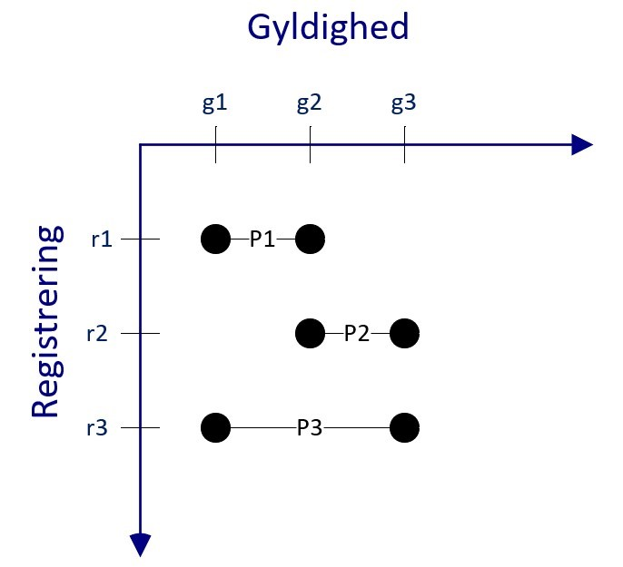
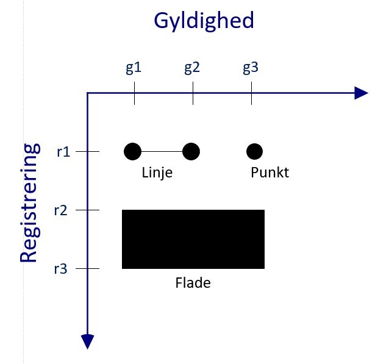

# Retningslinjer for webservices

## Indledning

Dette dokument beskriver fællesoffentlige retningslinjer for anvendelse af webservices og særligt REST (Representational State Transfer) webservices i it løsningerne i den offentlige sektor. Formålet med de fælles retningslinjer for webservices er at skabe bedre interoperabilitet imellem offentlige institutioners it-løsninger. 

Retningslinjerne er en konkretisering af princip 7 om at it-løsninger samarbejder effektivt, samt af arkitekturregel 7.1 om at der skal designes og udstilles snitflader efter fælles integrationsmønstre og tekniske standarder.

De fælles retningslinjer for webservices i dette dokument er en vejledning til serviceudbydere, der skal udstille data og funktionalitet via webservices. Vejledningen skal opfattes som en beskrivelse af god praksis og skal hjælpe serviceudbyderen, når denne designer og udstiller webservices rettet imod serviceanvendere.

### Definitioner:

* Webservices er defineret som angivet i  \[W3C\]: “A Web service is a software system designed to support interoperable machine-tomachine interaction over a network. It has an interface described in a machine-processable format (specifically WSDL)” ”We can identify two major classes of Web services:
  * REST-compliant Web services, in which the primary purpose of the service is to manipulate XML representations of Web resources using a uniform set of "stateless" operations; and
  * arbitrary Web services, in which the service may expose an arbitrary set of operations.“
* REST er en arkitekturstil, der anvendes til udstilling af ressourcer (data) med webservices. REST er baseret på principperne og arkitekturen, som anvendes på internettet, og genbruger få, udbredte standarder og protokoller herfra, f.eks. HTTP. \[FIELDING\]. 

En række domæner har i dag allerede domænespecifikke retningslinjer og standarder, fx på sundhedsområdet. Det er væsentligt, at anvendelsen af retningslinjerne finder sted i samspil med eksisterende retningslinjer og standarder, således at der ikke skabes unødig kompleksitet. De fælles retningslinjer er særligt anvendelige, hvor der ikke foreligger domænespecifikke standarder og retningslinjer for webservices.

### Afgrænsning

Retningslinjerne har følgende væsentlige afgrænsninger:

* Retningslinjerne stiller ikke krav til, at offentlige institutioner skal anvende REST over andre arkitekturstile, når data og funktionalitet skal udstilles via webservices.
* Serviceanvendere kan have behov for at kalde mere end én webservice. Et eksempel herpå er en serviceanvender, som skal foretage en opdatering i to it-løsninger via to forskellige webservices. Sådanne situationer er omfattet af begrebet ”serviceorkestrering”, der inkluderer kald af flere services. Retningslinjerne i dette dokument omfatter ikke serviceorkestrering, da det indeholder designvalg omkring processer og orkestrering, som ikke er en del af retningslinjernes område.
* Retningslinjerne stiller ikke krav om hvornår temporaler generelt skal anvendes i webservices, dette er serviceudstillers beslutning, retningslinjer stiller således kun krav til hvordan webservices udstiller temporaler.
* Retningslinjerne stiller krav til logning i forbindelse med webservicens anvendelse, og dokumentet indeholder ikke retningslinjer, som sikrer overholdelse af bestemt lovgivning, fx GDPR. 
* Retningslinjerne i dette dokument kan den enkelte organisation vælge at anvende inden for egen organisation for at skabe mere ensartede snitflader på tværs af it-løsninger, men det er ikke et krav.

### Læsevejledning

Dokumentet er opbygget i seks hovedafsnit. 

* Nærværende afsnit udgør en kort indledning. 
* Derefter følger en redegørelse for de principper og forretningsbehov, der ligger til grund for de angivne retningslinjers udformning.
* Næste afsnit ndeholder angivelse af generelle retningslinjer, der skal anvendes af webservices og kan være anvendelige for alle. Retningslinjerne er grupperet efter tema, således at retningslinjerne hurtigt kan identificeres ud fra læserens behov. 
* Det efterfølgende afsnit indeholder en angivelse af retningslinjer, der er specifikke for REST webservices. 
* Dokumentet indeholder også en referenceliste.
* Afsluttende beskrives et tværgående eksempel.

Dokumentet henviser til følgende bilag:

* [Bilag 1 ”Dokumentation for REST Webservices”](https://arkitektur.digst.dk/node/1164) Bilaget giver uddybende beskrivelse af retningslinje R06.
* [Bilag 2 ”Fejlstruktur og fejlkoder for REST Webservices”](https://arkitektur.digst.dk/node/1165) omhandler ensretning af fejlstrukturer for webservices og ensartet anvendelse af HTTP headers og håndtering af asynkrone kald.
* [Bilag 3 ”Nonfunktionelle krav til realisering af retningslinjer”](https://arkitektur.digst.dk/node/1166) indeholder et kravbilag, som kan anvendes af serviceudbydere til at kravstille webservices, som overholder retningslinjerne.
* [Bilag 4 ”Specifikation for brug af HTTP til REST”](https://arkitektur.digst.dk/node/1167) uddyber mere detaljeret anvendelsen af REST over HTTP. REST giver stor mulighed for fleksibilitet i udarbejdelsen af snitfladen, men bilagets formål er at skabe større ensartethed på almindeligt udstillet funktionalitet.

### 

### Oversigt over retningslinjer

Dokumentet indeholder følgende retningslinjer opdateret efter tema.

| Nr.    | Retningslinje                                                                                                     |
| ------ | ----------------------------------------------------------------------------------------------------------------- |
| &nbsp; | **Fokus på serviceanvendere**                                                                                     |
| R01.   | Udstil minimal funktionalitet og data i den enkelte webservice                                                    |
| R02.   | Separér webservices fra konkret implementering                                                                    |
| R03.   | Separér webservices fra eksterne afhængigheder                                                                    |
| &nbsp; | Ansvarsfordeling ved kald til webservices                                                                         |
| R04.   | Understøt gentagne forsøg på kald fra serviceanvenderen                                                           |
| R05.   | Kræv specifikkke informationer ved ansvarsoverdragelse ved kald til webservices                                   |
| &nbsp; | **Servicedokumentation**                                                                                          |
| R06.   | Dokumentér udstillede webservices i overensstemmelse med den fællesoffentlige dokumentationsramme for webservices |
| R07.   | Opmærk webservices i henhold til fællesoffentlige emnesystematikker                                               |
| R08.   | Opmærk webservices med følsomhed eller fortrolighed af data                                                       |
| R09.   | Dokumentér servicespecifikke fejlkoder for webservices                                                            |
| R10.   | Dokumentér drift af forskellige versioner af webservices                                                          |
| &nbsp; | **Serviceversionering**&nbsp;                                                                                     |
| R11.   | Anvend semantisk versionering af webservices                                                                      |
| R12.   | Viderefør gamle versioner, når en webservice ændres                                                               |
| &nbsp; | **Servicelogning**&nbsp;                                                                                          |
| R13.   | Log alle kald til webservices                                                                                     |
| R14.   | Anvend transaktionsidentifikatorer ved kald og svar                                                               |
| R15.   | Anvend requestID ved kald og svar                                                                                 |
| &nbsp; | **Servicetilgængelighed**&nbsp;                                                                                   |
| R16.   | Understøt monitorering af udstillede webservices                                                                  |
| &nbsp; | **Servicefejlmeddelelser**&nbsp;                                                                                  |
| R17.   | Returnér servicespecifikke fejl som standardiserede fejlmeddelelser                                               |
| &nbsp; | Temporale ressourcer                                                                                              |
| R18.   | Forretningsregler vedrørende temporaler indkapsles og håndhæves på serviceniveau                                  |
| R19.   | Webservices med temporale ressourcer returnerer som et øjebliksbillede                                            |
| R20.   | Webservices med temporale ressourcer anvender anerkendte nøgleord i søgeparametre.                                |
| R21.   | Webservices med temporale ressourcer skal udstille ensartet funktionalitet til revision og Linje                  |
| R22.   | Webservices med temporale ressourcer skal&nbsp; anvende ens håndtering af tidspunkter                             |
| &nbsp; | Sikkerhedskrav til webservices                                                                                    |
| R23.   | Webservices skal have tokenbaseret sikkerhed&nbsp;                                                                |

Retningslinjerne beskrives efter følgende mønster:

|                                |                                                                                                  |
| ------------------------------ | ------------------------------------------------------------------------------------------------ |
| Navn                           | Angiver nummeret og navnet på retningslinjen                                                     |
| Retningslinje                  | Beskriver retningslinjen klart og præcist                                                        |
| Rationale                      | Beskriver forretningsværdien ved at følge retningslinjen                                         |
| Understøttede forretningsbehov | Beskriver de konkrete forretningsbehov, som retningslinjen understøtter                          |
| Implikation                    | Beskriver hvilken indvirkning, retningslinjen har på forretningsmæssig og teknisk implementering |

Før beskrivelsen af hver retningslinje kan der være en kort indledning, der forklarer baggrunden for retningslinjen. Denne indledning anses ikke som en del af retningslinjen, men skal blot give læseren yderligere viden, kontekst og baggrund for at forstå den pågældende retningslinje.

## Principper og forretningsbehov for retningslinjer

Retningslinjerne for webservices er udarbejdet med henblik på at være bredt anvendelige i den offentlige sektor. Retningslinjerne er baseret på praktisk erfaring, samt målrettet anvendelse i realiseringen af Hvidbog om arkitektur for digitalisering. Anvendeligheden sikres ved specificering af tre overordnede principper samt en række forretningsbehov, som retningslinjerne udmønter. Principper og forretningsbehov i dette afsnit har således udgjort grundlaget for udarbejdelsen af retningslinjerne, der fremgår senere i dokumentet. 

Den organisation, som ønsker at anvende retningslinjerne, bør undersøge, om organisationen har forretningsbehov, der adskiller sig væsentligt fra de her anførte forretningsbehov. Hvis dette er tilfældet, kan organisationen overveje, hvorvidt snitfladerne skal udarbejdes efter retningslinjerne. Tilsvarende kan det være nødvendigt, at den pågældende organisationen tager stilling til, hvilke forretningsbehov, der er vigtigst.

### Principper

Følgende tre principper gælder for alle retningslinjerne:

* Retningslinjerne skal kunne anvendes bredt af offentlige institutioner, samt andre organisationer der ønsker at anvende dem.
* Retningslinjerne skal baseres på viden fra anvendelser af eksisterende retningslinjer for webservices, bl.a. fra SKAT, Sundhedsdatastyrelsen, Grunddataprogrammet, KOMBIT m.fl.
* Retningslinjerne skal være langtidsholdbare, men samtidig være tilstrækkeligt konkrete og implementeringsnære til, at retningslinjerne kan inddrages af initiativerne i digitaliseringsstrategien.

Forretningsbehov er opdelt i tre overordnede temaer.

### Tema 1: Forretningsbehov vedrørende serviceanvendere og serviceudbydere

Temaet addresserer dilemmaet i at designe services, der er bedst for både serviceanvendere og serviceudbydere. Retningslinjerne sætter fokus på, at serviceudbydere prioriterer servicenanvendernes behov og har et udefra-og-ind perspektiv, når webservices skal designes. Dermed menes, at serviceudbyder forstår formålet med webservicen fra serviceanvenderens perspektiv.

|     |                                                                                                                                                                                                                                                                                                                                                                                                                                                                                                                                                                                                                                                                                                                                                                                                                                                                                                                                                                                                                                                                                                                                                            |
| --- | ---------------------------------------------------------------------------------------------------------------------------------------------------------------------------------------------------------------------------------------------------------------------------------------------------------------------------------------------------------------------------------------------------------------------------------------------------------------------------------------------------------------------------------------------------------------------------------------------------------------------------------------------------------------------------------------------------------------------------------------------------------------------------------------------------------------------------------------------------------------------------------------------------------------------------------------------------------------------------------------------------------------------------------------------------------------------------------------------------------------------------------------------------------- |
| F1. | Webservices skal være omkostningseffektive set i et fællesoffentligt perspektiv, således at der er fokus på totalomkostningen for serviceanvendere og serviceudbydere i webservicens levetid. Webservices skal kunne realiseres af serviceudbydere ved brug af eksisterende og velbeskrevne metoder samt udbredte værktøjer og rammeværk.                                                                                                                                                                                                                                                                                                                                                                                                                                                                                                                                                                                                                                                                                                                                                                                                                  |
| F2. | Design af webservices skal tage udgangspunkt i serviceanvenderens behov. Det vil sige, at webservices udstilling af data og funktionalitet er intuitiv og enkel at anvende for en serviceanvender.                                                                                                                                                                                                                                                                                                                                                                                                                                                                                                                                                                                                                                                                                                                                                                                                                                                                                                                                                         |
| F3. | Ændringer i webservices skal udformes således, at det er så omkostningseffektivt som muligt for serviceanvendere.   Ændring af udstillede webservices medfører nødvendige tilpasninger hos serviceanvendere. Ændringer hos serviceanvendere medfører ekstra omkostninger og kan give stærke bindinger i it-landskabet, ved at en serviceudbyder ikke kan ændre en webservice før væsentlige serviceanvendere, eller i værste tilfælde alle serviceanvendere, er klar til ændringen. Hvis antallet af serviceanvendere for den pågældende webservice er højt, udgør omkostninger til serviceanvenderes it-løsninger typisk størstedelen af den samlede omkostning ved en ændring af webservicen. Design af webservices skal derfor have som mål at minimere konsekvenser for serviceanvendere ved ændringer i en webservice. Det vil være totaløkonomisk fordelagtigt at mindske bindingerne mellem serviceudbyder og serviceanvender, idet bindingerne sænker forandringsevnen i it-landskabet. Dette kan ske ved, at services i høj grad er bagudkompatible, og hver operation i en webservice er fokuseret på netop én forretningsmæssig handling. |
| F4. | Webservices skal have en entydig mekanisme til ansvarsoverdragelse mellem myndigheder, således at der altid er klarhed over, hvilken myndighed der har ansvaret for en given myndighedsopgave. Ansvarsoverdragelse kan fx være frigørende virkning for en myndighed ved aflevering af meddelelser til Digital Post.                                                                                                                                                                                                                                                                                                                                                                                                                                                                                                                                                                                                                                                                                                                                                                                                                                        |
| F5. | Webservices skal kunne understøtte forandringer i serviceanvenderes forretningskrav ved hurtigt at kunne understøtte ændringer i data og funktionalitet samt hurtigt at kunne skalere til ændret forbrug heraf.                                                                                                                                                                                                                                                                                                                                                                                                                                                                                                                                                                                                                                                                                                                                                                                                                                                                                                                                            |

### Tema 2: Forretningsbehov vedrørende data og funktionalitet

Temaet fokuserer på behovene for, at udstilling af data via webservices sker på en måde, som sikrer mest mulig interoperabilitet.

|      |                                                                                                                                                                                                                                                     |
| ---- | --------------------------------------------------------------------------------------------------------------------------------------------------------------------------------------------------------------------------------------------------- |
| F6.  | REST webservices skal udstille forretningsobjekter som ressourcer på en  ensartet måde for at sikre interoperabilitet, jf. afsnit 2.1.                                                                                                              |
| F7.  | Udstilling af webservices skal omfatte dokumentation af de pågældende webservices, herunder dokumentation af regler for syntaks og semantik samt beskrivelse af snitfladen. Dokumentationen skal være tilgængelig både for personer og it-systemer. |
| F8.  | REST webservices skal anvende relevante eksisterende og kommende fællesoffentlige datastandarder og profiler for REST ved udvikling af nye versioner af en REST webservice.                                                                         |
| F9.  | Webservices skal udstille data i bredt anvendte dataformater.                                                                                                                                                                                       |
| F10. | Webservices skal tage højde for, at data kan have forskellige grader af fortrolighed, hvilket stiller forskellige krav[1](#fodnote 1) til egenskaberne ved en webservice. Fx kan en webservice udstille personoplysninger.                          |

### Tema 3: Forretningsbehov vedrørende stabil og sikker driftsafvikling

Temaet omhandler behovene for, at webservices kan indgå i et fællesoffentligt itlandskab på en forvaltningsmæssig sikker og effektiv måde.

|      |                                                                                                                                                                                                                                                                                                                                 |
| ---- | ------------------------------------------------------------------------------------------------------------------------------------------------------------------------------------------------------------------------------------------------------------------------------------------------------------------------------- |
| F11. | Serviceudbydere skal kunne dokumentere anvendelsen af data og funktionalitet i webservices, herunder webservicens håndterinng af svartider og fejlsituationer.                                                                                                                                                                  |
| F12. | Webservices skal kunne overvåges, og transaktioner skal kunne spores på tværs af webservices. Webservices skal udstille tilstrækkelige data til at kunne indgå i orkestrering, herunder indeholde dubletkontrol og ensartet struktur af fejlbeskeder.                                                                           |
| F13. | Webservices skal kunne udstille adgang til data og funktionalitet af fortrolig eller følsom karakter. Når serviceudbyderen anvender (f.eks. danske udgaver af) udbredte, gældende sikkerhedsstandarder i stedet for at definere egne sikkerhedsmodeller, vil kravene til databeskyttelse med højere sandsynlighed være opfyldt. |

## Generelle retningslinjer for webservices

Dette afsnit indeholder retningslinjer, der understøtter forretningsbehovene beskrevet i det foregående afsnit og er generelt anvendelige ved implementering af webservices til it-løsninger i den offentlige sektor, herunder fx REST over HTTP og SOAP. Retningslinjer, der er specifikke for REST webservices, findes i det efterfølgende afsnit.

### Fokus på serviceanvendere

En webservice skal være så enkel at anvende som muligt. En webservice er enkel, når dens operationer udstiller en afgrænset mængde data og funktionalitet på en entydig måde for en bestemt serviceanvendelse. Dette medfører et større antal operationer og webservices, som er dedikeret til et bestemt forretningmæssigt formål. Ved ændringer i forretningsbehov eller ændret lovgivning er det kun en afgrænset mængde af webservices og/eller operationer, som påvirkes, og dermed påvirkes så få serviceanvendere som muligt. Et for stort antal webservices inden for et givet datadomæne vil til gengæld give mere kompleksitet for serviceanvendere i orkestrering og viden om sammenhænge mellem services.

En webservice, som udstiller generiske operationer[2](#fodnote 2), kan anvendes af mange serviceanvendere med forskellige behov. En generisk webservice får derfor mange serviceanvendere, der tilgår snitfladen, men kun anvender en delmængde af det udstillede data og funktionalitet. En ændring af en generisk webservice kan således medføre ændringer for alle serviceanvendere, selvom ændringen ikke omfatter delmængden af data eller funktionalitet, som anvendes af serviceanvendere. Det giver bindinger i it-miljøet. Serviceudbyderen har dermed reducerede muligheder for at ændre generiske webservices uden meromkostninger, risici og hensynstagen til serviceanvenderes tidsplaner.

|                                |                                                                                                                                                                                                                                                                                                                                                                                                                                                                                                                                                                                                                                                                                                                                                                                                                                                                                                                                                                                                                                                                                                                                                                                                                                                                                                                                                                                                                                                                                                                                                                                                                                                                                                                                                                                  |
| ------------------------------ | -------------------------------------------------------------------------------------------------------------------------------------------------------------------------------------------------------------------------------------------------------------------------------------------------------------------------------------------------------------------------------------------------------------------------------------------------------------------------------------------------------------------------------------------------------------------------------------------------------------------------------------------------------------------------------------------------------------------------------------------------------------------------------------------------------------------------------------------------------------------------------------------------------------------------------------------------------------------------------------------------------------------------------------------------------------------------------------------------------------------------------------------------------------------------------------------------------------------------------------------------------------------------------------------------------------------------------------------------------------------------------------------------------------------------------------------------------------------------------------------------------------------------------------------------------------------------------------------------------------------------------------------------------------------------------------------------------------------------------------------------------------------------------- |
| Navn:                          | R01. Udstil minimal funktionalitet og data i den enkelte webservice                                                                                                                                                                                                                                                                                                                                                                                                                                                                                                                                                                                                                                                                                                                                                                                                                                                                                                                                                                                                                                                                                                                                                                                                                                                                                                                                                                                                                                                                                                                                                                                                                                                                                                              |
| Retningslinje                  | Webservices skal designes således, at én webservice kun udstiller tilstrækkelig data eller funktionalitet for at give forretningsmæssig mening for en bestemt serviceanvendelse.                                                                                                                                                                                                                                                                                                                                                                                                                                                                                                                                                                                                                                                                                                                                                                                                                                                                                                                                                                                                                                                                                                                                                                                                                                                                                                                                                                                                                                                                                                                                                                                                 |
| Rationale                      | En ændring til data og funktionalitet skal som udgangspunkt kun medføre ændringer i den webservice, der udstiller funktionaliteten. På denne måde minimeres behovet for ændringer i etablerede serviceanvenderes klienter. Serviceanvenderes klienter skal kun ændres, hvis ændringen påvirker deres serviceanvendelse.                                                                                                                                                                                                                                                                                                                                                                                                                                                                                                                                                                                                                                                                                                                                                                                                                                                                                                                                                                                                                                                                                                                                                                                                                                                                                                                                                                                                                                                          |
| Understøttede forretningsbehov | Retningslinjen understøtter forretningsbehov F2 og F3, idet den medfører, at  serviceanvendere samlet set påvirkes mindre.                                                                                                                                                                                                                                                                                                                                                                                                                                                                                                                                                                                                                                                                                                                                                                                                                                                                                                                                                                                                                                                                                                                                                                                                                                                                                                                                                                                                                                                                                                                                                                                                                                                       |
| Implikation                    | En webservice løser ideelt set kun én opgave[3](#fodnote 3), hvilket har den konsekvens, at  genbrugeligheden af den enkelte webservice bliver reduceret. Til gengæld vil det samlede økosystem være bedre i stand til at håndtere ændringer, da det kun vil være serviceanvendere, som har behov for en ændring, som påvirkes.  Et eksempel er en søgefunktionalitet, som udstilles til mobile klienter og rige klienter. Her vil en anvendelse af et backend to frontend arkitetkurmønster kunne udmøntes i to webservices, en til mobile klienter og en til rige klienter. Ændringer til søgning i den rige klient vil ikke påvirke mobile klienter, da webservicen ikke vil ændres.Eksempelvist kan ” Lokalestyrelsen”, jf. appendiks A, udstille  en generisk ”Ret” funktion for forretningsobjektet ”mødelokale”, som indeholder et forretningsobjekt, som består af et mødelokale og tilhørende bookinger. Funktionen ”Ret mødelokale” skal således understøtte redigering af mødelokalets attributter, men også tilhørende bookinger. Det medfører, at samtlige serviceanvendere skal anvende ”Ret mødelokale”, selvom serviceanvendere har forskellige serviceanvendelser, hvor én kun retter mødelokalets data, og en anden kun opretter bookinger.  Et andet eksempel kunne være ved tilføjelse af et nyt obligatorisk attribut på mødelokale, så vil det være en breaking change for alle serviceanvendere.   En mere serviceanvenderrettet tilgang kunne fx være at anvende en service eller operation per serviceanvendelse, fx ”opret booking”, ”opdater mødelokale attributter”. I dette eksempel vil en tilføjelse af et nyt obligatorisk attribut på mødelokalet ikke påvirke serviceanvendere, som kun anvender funktionen ”opret booking”. |

|                                |                                                                                                                                                                                                                                                                                                                  |
| ------------------------------ | ---------------------------------------------------------------------------------------------------------------------------------------------------------------------------------------------------------------------------------------------------------------------------------------------------------------- |
| Navn:                          | R02. Separér webservices fra konkret implementering                                                                                                                                                                                                                                                              |
| Retningslinje                  | Webservices skal designes, så de afkobler implementeringen af interne og eksterne forretningsobjekter fra den snitflade, der udstilles imod serviceanvendere.                                                                                                                                                    |
| Rationale                      | Ved at anvende en facade, der afskærmer serviceanvenderen fra den konkrete implementering af data og funktionalitet i udbyderens interne miljø, vil serviceudbyderen opnå større friheder i implementeringen af webservicen.                                                                                     |
| Understøttede forretningsbehov | Retningslinjen er affødt af forretningsbehov F3 ved at afskærme serviceanvenderen fra udbyderens interne, flygtige og evt. irrelevante anvendelse af data og funktionalitet                                                                                                                                      |
| Implikation                    | Ved servicedesign bør det afdækkes, netop hvilke dele af et forretningsobjekt, der er behov for at gøre tilgængelige for anvendere. Webservicens design bør give disse dele en repræsentation, der ikke fastholder serviceudbyderen i den samme konkrete implementering af webservicen i hele servicens levetid. |

|                                |                                                                                                                                                                                                                                                                                                                                                                                                                                                                                                                                                                                                         |
| ------------------------------ | ------------------------------------------------------------------------------------------------------------------------------------------------------------------------------------------------------------------------------------------------------------------------------------------------------------------------------------------------------------------------------------------------------------------------------------------------------------------------------------------------------------------------------------------------------------------------------------------------------- |
| Navn:                          | R03. Separér webservices fra eksterne afhængigheder                                                                                                                                                                                                                                                                                                                                                                                                                                                                                                                                                     |
| Retningslinje                  | Webservices skal designes, så snitfladen udstiller egne datasæt og ikke har eksterne afhængigheder til andre domæners objekter.                                                                                                                                                                                                                                                                                                                                                                                                                                                                         |
| Rationale                      | Når webservicen udstiller en facade foran den bagvedliggende forretning, får serviceanvenderen kun det nødvendige data, for at reducere kompleksitet og gardere mod konsekvenser af ændringer fra bagvedliggende systemer.Forretningsmæssige webservices, der udstiller data, kan være en aggregering af data fra andre webservices. Webservicen definerer med andre ord sit eget datasæt (egen facade) eller gennemstiller data direkte. Såfremt data udstilles af webservicen som en facade, så vil ændringer til bagvedliggende webservices ikke påvirke serviceanvendere, medmindre facaden ændres. |
| Understøttede forretningsbehov | Retningslinjen er affødt af forretningsbehov F3 ved at afskærme serviceanvenderen fra fremmede forretningsobjekter.                                                                                                                                                                                                                                                                                                                                                                                                                                                                                     |
| Implikation                    | Ved servicedesign skal det afdækkes, hvilke dele af data der er behov for at gøre tilgængelige for anvendere. Samtidigt vil anvendelsen af facader dog øge omkostningen ved ændringer i bagvedliggende webservices, da facaden skal opdateres.                                                                                                                                                                                                                                                                                                                                                          |

### Ansvarsfordeling ved kald til webservices

Ved integrationer mellem forskellige myndigheders it-systemer er det centralt, at ansvaret for gennemførsel og fejlhåndtering ved en transaktion er tydeligt placeret. Dette gør sig særligt gældende ved kald til webservices, hvor funktionaliteten medfører overdragelse af ansvar mellem myndigheder. Fx kan det være i forbindelse med overførsel af en administrativ opgave i forbindelse med en partens flytning af bopælsadresse.

Ændring af data skal gennemføres entydigt. Serviceudbyderen skal derfor håndtere, at opdatering af hele ressourcer er idempotente, mens delvise opdateringer ikke er idempotente. Dette er uddybet i Bilag 2 ”Fejlstruktur og fejlkoder for REST Webservices” og Bilag 4 ”Specifikation for brug af HTTP til REST”.

|                                |                                                                                                                                                                                                                                                                                                                                                                                                                                                                                                                                                                                                                                                                                                                  |
| ------------------------------ | ---------------------------------------------------------------------------------------------------------------------------------------------------------------------------------------------------------------------------------------------------------------------------------------------------------------------------------------------------------------------------------------------------------------------------------------------------------------------------------------------------------------------------------------------------------------------------------------------------------------------------------------------------------------------------------------------------------------- |
| Navn:                          | R04. Understøt gentagne forsøg på kald fra serviceanvenderen                                                                                                                                                                                                                                                                                                                                                                                                                                                                                                                                                                                                                                                     |
| Retningslinje                  | En webservice skal entydigt kunne håndtere gentagne forsøg fra serviceanvenderen.                                                                                                                                                                                                                                                                                                                                                                                                                                                                                                                                                                                                                                |
| Rationale                      | En klar ansvarsplacering i forbindelse med gennemførsel af kald er nødvendig for, at informationer og evt. ansvar for behandling overdrages korrekt. Det er kun serviceanvenderen, der kan afgøre, om svaret på et kald er modtaget.                                                                                                                                                                                                                                                                                                                                                                                                                                                                             |
| Understøttede forretningsbehov | Retningslinjen er affødt af forretningsbehov F4.                                                                                                                                                                                                                                                                                                                                                                                                                                                                                                                                                                                                                                                                 |
| Implikation                    | Det er serviceanvenderen, der er ansvarlig for at gennemføre et kald, herunder at genforsøge kaldet, indtil et svar (en fejl eller en kvittering) modtages fra webservicen.  Hvis ansvarsoverdragelsen kræver, at et bagvedliggende forretningssystem skal opdateres asynkront, så gælder det, at REST webservices skal følge mønsteret for asynkrone kald, som beskrevet i Bilag 2 ”Fejlstruktur og fejlkoder for REST Webservices”.  Webservices kræver, at en serviceanvender medsender en transaktionsidentifikator ved alle kald, jf. retningslinje R14, derfor kan transaktionsidentifikatoren anvendes af serviceudstiller til at detektere gentagne forsøg, og håndtere gentagelsen korrekt. |

|                                |                                                                                                                                                                                                                                                                                                                                                                                                                                                                                                                                                                                                                                                                                                                                                                                                                                                                                                                                           |
| ------------------------------ | ----------------------------------------------------------------------------------------------------------------------------------------------------------------------------------------------------------------------------------------------------------------------------------------------------------------------------------------------------------------------------------------------------------------------------------------------------------------------------------------------------------------------------------------------------------------------------------------------------------------------------------------------------------------------------------------------------------------------------------------------------------------------------------------------------------------------------------------------------------------------------------------------------------------------------------------- |
| Navn:                          | R05. Kræv specifikke informationer ved ansvarsoverdragelse ved kald til webservices                                                                                                                                                                                                                                                                                                                                                                                                                                                                                                                                                                                                                                                                                                                                                                                                                                                       |
| Retningslinje                  | Webservices, der understøtter overdragelse af myndighedsansvar, skal kræve, at specifikke overdragelsesinformationer inkluderes i kaldet og skal eksplicit returnere en kvittering for, at overdragelsen er accepteret.                                                                                                                                                                                                                                                                                                                                                                                                                                                                                                                                                                                                                                                                                                                   |
| Rationale                      | Det skal være uomtvisteligt, hvornår en offentlig institution eller en organisation (som serviceanvender) har overdraget et ansvar til en anden myndighed eller en organisation (som serviceudbyder). For at sikre dette skal webservicen kræve, at serviceanvenderen har inkluderet specifikke informationer om overdragelse af ansvar i kaldet. Den valgte kommunikationsprotokols (fx HTTP) tekniske kvitteringer kan ikke nødvendigvis erstatte forretningsmæssige kvitteringer for ansvarsoverdragelse. Fx kan en snitflade måske ikke synkront opdatere de bagvedliggende forretningssystemer. Dermed kan serviceudbyder ikke give en forretningsmæssig kvittering, før alle bagvedliggende systemer er opdateret korrekt.                                                                                                                                                                                                          |
| Understøttede forretningsbehov | Retningslinjen er affødt af forretningsbehov F4.                                                                                                                                                                                                                                                                                                                                                                                                                                                                                                                                                                                                                                                                                                                                                                                                                                                                                          |
| Implikation                    | Serviceudbyderen skal designe webservicen således, at eksplicitte overdragelsesinformationer skal være til stede i et korrekt kald til webservicen. Disse informationer kan fx omfatte:  *   Identifikation af den ansvarsafgivende organisation/myndighed. *   Identifikation af den ansvarsmodtagende organisation/myndighed. *   En unik identifikator af denne ansvarsoverdragelse. *   En identifikation af hvilket ansvar, der overdrages, f.eks. ved reference til en aftalt klassifikation, emnesystematik eller lovgrundlag.  Serviceudbyderen skal realisere webservicen, så den returnerer et kvitteringssvar, der indikerer, at ansvaret er overdraget.   Såfremt en REST webservice opdaterer det bagvedligggende forretningsystem asynkront for at kunne overdrage ansvar, så skal forretningskvitteringen følge mønsteret beskrevet i Bilag 2 ”Fejlstruktur og fejlkoder for REST Webservices”. |

### Servicedokumentation

Serviceudbydere skal dokumentere alle udstillede webservices. Dokumentationen skal målrettes serviceanvenderens behov for information, både forretningsmæssigt og teknisk. God dokumentation målrettet serviceanvendere kan reducere omkostningerne, når udstillede webservices skal anvendes, da det bliver lettere for serviceanvenderen at vælge og bruge udstillede webservices korrekt. 

Serviceanvenderes behov består af forretningsforståelse og teknisk forståelse af data, der udveksles, samt koblingen mellem forretningsmodeller og konkrete datarepræsentationer. Forretningsmæssige krav om data og funktionalitet af den udstillede webservice er en central del af dokumentationen, der skal give serviceanvenderen tilstrækkelig viden.

|                                |                                                                                                                                                                                                                                                                                                                                                                                                                                                                                                                                                                                                                                                                                                                                                                                                                                                                                                                                                                                                                                                                                                         |
| ------------------------------ | ------------------------------------------------------------------------------------------------------------------------------------------------------------------------------------------------------------------------------------------------------------------------------------------------------------------------------------------------------------------------------------------------------------------------------------------------------------------------------------------------------------------------------------------------------------------------------------------------------------------------------------------------------------------------------------------------------------------------------------------------------------------------------------------------------------------------------------------------------------------------------------------------------------------------------------------------------------------------------------------------------------------------------------------------------------------------------------------------------- |
| Navn:                          | R06. Dokumentér udstillede webservices i overensstemmelse med den fællesoffentlige dokumentationsramme for webservices                                                                                                                                                                                                                                                                                                                                                                                                                                                                                                                                                                                                                                                                                                                                                                                                                                                                                                                                                                                  |
| Retningslinje                  | Dokumentationen for webservices skal følge den fællesoffentlige dokumentationsramme, der udgøres af Bilag 1 ”Dokumentation for REST Webservices”.                                                                                                                                                                                                                                                                                                                                                                                                                                                                                                                                                                                                                                                                                                                                                                                                                                                                                                                                                       |
| Rationale                      | God dokumentation er opdelt og opmærket på en måde, der gør, at dokumentationens enkeltdele målrettes de forskellige roller hos serviceanvenderen (f.eks. forretningsansvarlig eller it-arkitekt). Det er en nødvendig forudsætning, at den udstillede dokumentation altid er ajourført, så dokumentationen svarer til den udstillede webservice.  Alle webservices skal være dokumenterede i overensstemmelse med den fællesoffentlige dokumentationsramme, og dokumentationen skal være let tilgængelig, ajourført og svare til de udstillede webservices.   Dokumentationen muliggør, at serviceanvendere forstår, hvordan udstillede webservices anvendes uden at skulle konsultere eller kontakte serviceudbyderen. Ved fx at synliggøre semantik og syntaks sikres synlighed og ensartethed, så webservicedata og funktionalitet har samme betydning for både serviceudbyder og serviceanvender.   Serviceudbyderen mindsker ressourceforbruget i sin support, når let tilgængelig dokumentation medfører, at serviceanvenderen kan finde de relevante dele af dokumentationen. |
| Understøttede forretningsbehov | Retningslinjen er affødt af forretningsbehov F2.                                                                                                                                                                                                                                                                                                                                                                                                                                                                                                                                                                                                                                                                                                                                                                                                                                                                                                                                                                                                                                                        |
| Implikation                    | Krav til dokumentationen fremgår af den fællesoffentlige dokumentationsramme for webservices, som er beskrevet i Bilag 1 ”Dokumentation for REST Webservices”.  Dokumentation af webservices skal overholde de krav, som er angivet i Bilag 1 og skal stille tilsvarende dokumentation til rådighed, jf. Bilag 1.  For REST webservices gælder det, at serviceudstiller skal anvende OpenAPI med SmartAPI udvidelser. Ved alle ændringer til webservicen skal dokumentationen opdateres, senest når ændringen idriftsættes, således at en webservice altid er udstillet med opdateret dokumentation.                                                                                                                                                                                                                                                                                                                                                                                                                                                                                        |

|                                |                                                                                                                                                                                                                                                                                                                                                                                                                                                                                                                        |
| ------------------------------ | ---------------------------------------------------------------------------------------------------------------------------------------------------------------------------------------------------------------------------------------------------------------------------------------------------------------------------------------------------------------------------------------------------------------------------------------------------------------------------------------------------------------------- |
| Navn:                          | R07. Opmærk webservices i henhold til fællesoffentlige emnesystematikker                                                                                                                                                                                                                                                                                                                                                                                                                                               |
| Retningslinje                  | Serviceudbyderen skal opmærke udstillede webservices i henhold til fællesoffentlige emnesystematikker.                                                                                                                                                                                                                                                                                                                                                                                                                 |
| Rationale                      | Serviceudbyderen skal opmærke webservices i henhold til emnesystematik, således at serviceanvendere tydeligt kan se, hvilken offentlig forvaltning, forvaltningsproces eller anden proces hos serviceudbyderen, webservicen er udstillet i relation til. Som en del af den forretningsrelaterede del af dokumentation for webservices skal serviceanvenderen bibringes viden om, hvilken offentlig forvaltning, forvaltningsprocesser eller andre processer, webservicen er en del af hos serviceudbyderen.            |
| Understøttede forretningsbehov | Retningslinjen er affødt af forretningsbehov F2.                                                                                                                                                                                                                                                                                                                                                                                                                                                                       |
| Implikation                    | Dokumentationen af den enkelte webservice skal inkludere opmærkning i henhold til fællesoffentlige emnesystematikker, dvs. enten KLE, FORM eller anden relevant, anerkendt fællesoffentlig emnesystematik.  Opmærkningen beskrives for den enkelte webservice. Hvis en webservice indgår i flere forvaltningsprocesser eller forvaltningsemner, skal alle emnerne angives i dokumentationen.  Opmærkningen for REST webservices skal foretages som angivet i Bilag 1 ”Dokumentation for REST Webservices”. |

|                                |                                                                                                                                                                                                                                                                                                                                                                                                                                                                                                                                                                                                                                                                                                                                                                                                                             |
| ------------------------------ | --------------------------------------------------------------------------------------------------------------------------------------------------------------------------------------------------------------------------------------------------------------------------------------------------------------------------------------------------------------------------------------------------------------------------------------------------------------------------------------------------------------------------------------------------------------------------------------------------------------------------------------------------------------------------------------------------------------------------------------------------------------------------------------------------------------------------- |
| Navn:                          | R08. Opmærk webservices med følsomhed eller fortrolighed af data                                                                                                                                                                                                                                                                                                                                                                                                                                                                                                                                                                                                                                                                                                                                                            |
| Retningslinje                  | Serviceudbyderen skal i dokumentationen opmærke udstillede webservices med en angivelse af følsomhed/fortrolighed af data, der skal angives enten ved kald eller returneres ved svar.                                                                                                                                                                                                                                                                                                                                                                                                                                                                                                                                                                                                                                       |
| Rationale                      | Serviceudbyderen angiver følsomhed for de data, der overføres ved brug af webservicen (dvs. både kald og svar) i dokumentationen. Som en del af den sikkerhedsrelevante del af dokumentation for webservices skal serviceudbyderen angive følsomhed eller fortroligheden, så det fremstår tydeligt overfor serviceanvenderen, hvordan data til og fra webservicen skal behandles.                                                                                                                                                                                                                                                                                                                                                                                                                                           |
| Understøttede forretningsbehov | Retningslinjen er affødt af forretningsbehov F2.                                                                                                                                                                                                                                                                                                                                                                                                                                                                                                                                                                                                                                                                                                                                                                            |
| Implikation                    | Opmærkningen angives ikke i selve kaldet eller svaret, men som en del af webservicens dokumentation. Dokumentationen af den enkelte webservice skal inkludere opmærkning i henhold til klassificering af følsomhed og fortrolighed i den fællesoffentlige dokumentationsramme for webservices.  Opmærkningen påføres den enkelte webservice i form af angivelse af fortroligheds- eller følsomhedsniveauer fra en klassifikation af niveauer i den fællesoffentlige dokumentationsramme.   En REST webservice skal opmærke følsomhed og fortrolighed i OpenAPI, jf. Bilag 1 ”Dokumentation for REST Webservices”.  Hvis en webservice har data med flere niveauer, angives det højeste niveau af følsomhed eller fortrolighed, jf. klassifikation af niveauer i den fællesoffentlige dokumentationsramme. |

Serviceanvenderen har behov for at kende til de servicespecifikke fejl, en webservice kan returnere som svar på kald til webservicen. Servicespecifikke fejl er fejl, der opstår i udveksling mellem service og serviceanvender. Fx hvis serviceanvenderen har angivet en værdi, der ikke tillades af webservicen. Denne fejl er servicespecifik, da den (først) opstod i forbindelse med webservicens behandling af kaldet, efter kaldet var transporteret til webservicen. 

|                                |                                                                                                                                                                                                                                                                                                                                                                                                                                                                                                                                                                                                                                                                                                                                                                                                                                             |
| ------------------------------ | ------------------------------------------------------------------------------------------------------------------------------------------------------------------------------------------------------------------------------------------------------------------------------------------------------------------------------------------------------------------------------------------------------------------------------------------------------------------------------------------------------------------------------------------------------------------------------------------------------------------------------------------------------------------------------------------------------------------------------------------------------------------------------------------------------------------------------------------- |
| Navn:                          | R09. Dokumentér servicespecifikke fejlkoder for webservices                                                                                                                                                                                                                                                                                                                                                                                                                                                                                                                                                                                                                                                                                                                                                                                 |
| Retningslinje                  | Alle servicespecifikke fejl, der kan returneres fra en webservice, skal dokumenteres, og dokumentationen skal indgå i webservicens dokumentation og gøres tilgængelig for serviceanvendere.                                                                                                                                                                                                                                                                                                                                                                                                                                                                                                                                                                                                                                                 |
| Rationale                      | Serviceanvendere skal kunne forstå, hvorfor kald til en udstillet webservice ikke kan gennemføres, så serviceanvenderen eventuelt kan kompensere for problemet. Hvis servicespecifikke fejl dokumenteres, får serviceanvenderen mulighed for selv at løse problemerne i stedet for at skulle bebyrde serviceudbyderen med bistand til at løse problemet.                                                                                                                                                                                                                                                                                                                                                                                                                                                                                    |
| Understøttede forretningsbehov | Retningslinjen er affødt af forretningsbehov F2.                                                                                                                                                                                                                                                                                                                                                                                                                                                                                                                                                                                                                                                                                                                                                                                            |
| Implikation                    | Dokumentationen for webservices skal inkludere en oversigt over alle servicespecifikke fejl, samt dokumentation af hver enkelt servicespecifik fejl.   Dokumentationen af den enkelte servicespecifikke fejl bør angive, hvilken fejlkode (en værdi) fejlen er identificeret ved, en fejlbeskrivelse og årsag.   Dokumentationen af servicespecifikke fejl er en del af webservicens dokumentation og skal udstilles til serviceanvendere. Fejlhåndtering for serviceudbyder omfatter ikke fejl i infrastrukturen mellem serviceanvender og webservice.  Fejlbeskrivelser og statuskoder for REST webservices skal overholde retningslinjerne for servicefejlmeddelelser, jf. Bilag 4 ”Specifikation for brug af HTTP til REST”og .Fejlstrukturer for alle webservices skal overholde fejlstrukturen beskrevet i bilag 4. |

Serviceudbydere vil øge interoperabiliteten ved at tydeliggøre ændringer til webservices, så serviceanvendere kan afgøre, om ændringens effekt fordrer konsekvensændringer hos dem selv. 

|                                |                                                                                                                                                                                                                                                                                                                                                                                                                                                                                                                                                                                                                                                                                                                                                                                                                                                                                                                                                                                                                                                                                |
| ------------------------------ | ------------------------------------------------------------------------------------------------------------------------------------------------------------------------------------------------------------------------------------------------------------------------------------------------------------------------------------------------------------------------------------------------------------------------------------------------------------------------------------------------------------------------------------------------------------------------------------------------------------------------------------------------------------------------------------------------------------------------------------------------------------------------------------------------------------------------------------------------------------------------------------------------------------------------------------------------------------------------------------------------------------------------------------------------------------------------------ |
| Navn:                          | R10. Dokumentér drift af forskellige versioner af webservices                                                                                                                                                                                                                                                                                                                                                                                                                                                                                                                                                                                                                                                                                                                                                                                                                                                                                                                                                                                                                  |
| Retningslinje                  | Serviceudbyderen skal dokumentere vilkårene i forbindelse med samtidig driftsafvikling af versioner af den samme webservice.                                                                                                                                                                                                                                                                                                                                                                                                                                                                                                                                                                                                                                                                                                                                                                                                                                                                                                                                                   |
| Rationale                      | Serviceanvendere kan få fordel af at være tydeligt informerede om de vilkår, der gælder, når serviceudbyderen udstiller forskellige versioner af en webservice. Serviceanvenderen skal vide, hvor lang tid denne har til at tilpasse sig en ny version af en webservice, hvis der foretages en ikkekompatibel ændring af denne, jf. retningslinje R11 om versionering).                                                                                                                                                                                                                                                                                                                                                                                                                                                                                                                                                                                                                                                                                                        |
| Understøttede forretningsbehov | Retningslinjen er affødt af forretningsbehov F2.                                                                                                                                                                                                                                                                                                                                                                                                                                                                                                                                                                                                                                                                                                                                                                                                                                                                                                                                                                                                                               |
| Implikation                    | Serviceudbyderen skal fastlægge og dokumentere sin release- og versioneringsstrategi for den enkelte webservice, jf. retningslinje R11, og publicere denne sammen med dokumentationen for udstillede webservices. Serviceudbydere skal dokumentere deres strategi for, i hvilket omfang forskellige versioner af en udstillet webservice driftsafvikles samtidigt. Serviceanvendere får dermed en forståelse for, hvor hurtigt de skal tilpasse sig ved ændringer til webservice.  Det bør fremgå af dokumentationen:  *   Hvordan webservices versioneres i henhold til R11. *   Hvor længe gensidigt inkompatible webservices udstilles i flere udgaver, samt antallet heraf. *   Om, og i givet fald hvor længe i forvejen, serviceudbyderen adviserer serviceanvendere om ændringer. *   Hvordan serviceanvendere eventuelt kan identficere sig over for serviceudbyder. *   Hvordan serviceudbyderen udstiller en oversigt over konkrete datoer for publicering af nye webservices samt ændringer til og nedlæggelse af eksisterende webservices. |

### Serviceversionering

Det er centralt for serviceanvendere, at de er i stand til at afgøre, om en ændring til en webservice kræver korresponderende ændringer hos serviceanvenderen. Konsekvenserne af sådanne ændringer skal generelt minimeres.

Når ændringer er nødvendige, skal webservicens version tydeligt indikere over for serviceanvenderen, om webservicen er kompatibel med den tidligere udgave.

Ved kompatibilitet forstås i denne forbindelse, at én version af en webservice er kompatibel med en tidligere version, hvis der ingen ændringer kræves hos serviceanvenderen. 

Versionering af udstillede webservices er via mekanismen ”semantisk versionering”[4](#fodnote 4) et middel til at gøre det klart, tydeligt og entydigt over for serviceanvendere, om der er fortaget ændringer, der kræver handling fra serviceanvenderens side. Ifølge reglerne for semantisk versionering anvendes et versionsnummer med tre dele: major version, minor version og patch version. Reglerne for versionsnumre er således:

* To versioner af en webservice med forskellige major versioner (f.eks. 1.1 og 2.0) er ikke kompatible. En serviceanvender, der anvender version 1.1 af webservicen, vil skulle foretage ændringer for at kunne anvende version 2.0 af webservicen. 
* Når to versioner af en webservice har samme major version men forskellige minor versioner (f.eks. 1.1 og 1.2), er version 1.2 af webservicen kompatibel med version 1.1. Serviceanvenderen skal derfor ikke foretage sig noget for at skifte fra version 1.1 til 1.2, men der er formodentlig mulighed for at anvende mere funktionaltiet i den nye version.

Hvis to versioner af en webservice har samme major og minor version men forskellig patch version, skal serviceanvenderen ikke foretage sig noget for at skifte mellem de to versioner.I denne forbindelse er det væsentligt, hvilken ressource der versioneres. Serviceudbyderen kan dog ikke ændre den faste del uden at ændre en ressources URI, som er den unikke sti til en given ændring, fx ændring af serverens DNS navn i en HTTP URI for en REST ressource – dette opfattes derfor som en ikke-kompatibel ændring.

|                                |                                                                                                                                                                                                                                                                                                                                                                                                                                                                                                                                                                                                                                                                                                                                                                                                                                                                                                                                                                   |
| ------------------------------ | ----------------------------------------------------------------------------------------------------------------------------------------------------------------------------------------------------------------------------------------------------------------------------------------------------------------------------------------------------------------------------------------------------------------------------------------------------------------------------------------------------------------------------------------------------------------------------------------------------------------------------------------------------------------------------------------------------------------------------------------------------------------------------------------------------------------------------------------------------------------------------------------------------------------------------------------------------------------- |
| Navn:                          | R11. Anvend semantisk versionering af webservices                                                                                                                                                                                                                                                                                                                                                                                                                                                                                                                                                                                                                                                                                                                                                                                                                                                                                                                 |
| Retningslinje                  | Webservices skal anvende semantisk versionering til at tydeliggøre kompatibilitet og overholde versioneringsreglerne.                                                                                                                                                                                                                                                                                                                                                                                                                                                                                                                                                                                                                                                                                                                                                                                                                                             |
| Rationale                      | Serviceanvendere skal gøres tydeligt opmærksomme på, hvornår ændringer til en udstillet webservice er kompatibel med eksisterende serviceanvendelser, og hvornår dette ikke er tilfældet. Semantisk versionering indeholder flere komponenter i et versionsnummer, der gør dette klart: ændringer i ”major” komponenten i servicens versionsnummer betyder brud på kompatibilitet med eksisterende serviceanvendelser.                                                                                                                                                                                                                                                                                                                                                                                                                                                                                                                                            |
| Understøttede forretningsbehov | Retningslinjen er affødt af forretningsbehov F2 og F3.                                                                                                                                                                                                                                                                                                                                                                                                                                                                                                                                                                                                                                                                                                                                                                                                                                                                                                            |
| Implikation                    | Webservices skal garantere kompatibilitet mellem versioner af en webservice ifølge reglerne for semantisk versionering.  Webservices kan eventuelt understøtte, at serviceanvenderen kan specificere den ønskede version af webservicen i forbindelse med et kald.   En konsekvens af denne versionering er, at følgende ændringer generelt medfører en ny major version:  *   En valgfri kaldsparameter bliver obligatorisk. *   Tilføjelse af en ny obligatorisk parameter ved kald. *   Fjernelse af værdier i svar. *   Semantiske ændringer af data i kald eller svar  Listen er ikke udtømmende.  Andre ændringer, som fx ændring af sikkerhedsmodel og sletning af udstillede attributter eller relationer, er normalt en ikke-kompatibel ændring. Andre ikke-kompatible ændringer, der kræver nyt versionsnummer, er f.eks. introduktion af nye obligatoriske parametre eller begrænsning i mængden af mulige parametre. |

|                                |                                                                                                                                                                                                                                                                                                                                                                                                                                                                                                                            |
| ------------------------------ | -------------------------------------------------------------------------------------------------------------------------------------------------------------------------------------------------------------------------------------------------------------------------------------------------------------------------------------------------------------------------------------------------------------------------------------------------------------------------------------------------------------------------- |
| Navn:                          | R12. Viderefør gamle versioner, når en webservice ændres                                                                                                                                                                                                                                                                                                                                                                                                                                                                   |
| Retningslinje                  | Serviceudbyderen skal videreføre versioner i en tilstrækkelig overgangsperiode.                                                                                                                                                                                                                                                                                                                                                                                                                                            |
| Rationale                      | Når der sker ikke-kompatible ændringer til udstillede webservices bør både den nye version og den hidtidige version være tilgængelige samtidigt i en overgangsperiode for at lette overgangen og mindske tidspresset for serviceanvenderne.  Eksisterende serviceanvendere vil kun undtagelsesvist skulle tilpasse sig til brug af en ændret webservice. Serviceudbyderen må derfor antage, at serviceanvendere har behov for en overgangsperiode, hvor både gammel og ny udgave af webservicen udstilles samtidigt. |
| Understøttede forretningsbehov | Retningslinjen er affødt af forretningsbehov F2 og F3.                                                                                                                                                                                                                                                                                                                                                                                                                                                                     |
| Implikation                    | Hvis ændringen udgør en breaking change, skal serviceudbyderen udstille både ny og gammel version af webservicen i en overgangsperiode. Serviceudbyderen skal dokumentere dette, jf. retningslinje R10.                                                                                                                                                                                                                                                                                                                    |

### Servicelogning

I forbindelse med integration mellem it-løsninger er det nødvendigt, på forlangende, at kunne redegøre for afviklingen af et kald og svar herpå. Typiske fejlsituationer kunne fx være, at en given handling fra en bruger har forårsaget en fejl, som er opstået i kæde af servicekald. 

|                                |                                                                                                                                                                                                                                                                                                                                                                                                                                                                                                                                                                                                                                                                                                                                                                                                                               |
| ------------------------------ | ----------------------------------------------------------------------------------------------------------------------------------------------------------------------------------------------------------------------------------------------------------------------------------------------------------------------------------------------------------------------------------------------------------------------------------------------------------------------------------------------------------------------------------------------------------------------------------------------------------------------------------------------------------------------------------------------------------------------------------------------------------------------------------------------------------------------------- |
| Navn:                          | R13. Log alle kald til webservices                                                                                                                                                                                                                                                                                                                                                                                                                                                                                                                                                                                                                                                                                                                                                                                            |
| Retningslinje                  | Alle væsentlige kald til og svar fra webservices skal logges af serviceudbyderen.                                                                                                                                                                                                                                                                                                                                                                                                                                                                                                                                                                                                                                                                                                                                             |
| Rationale                      | Det skal sikres, at alle væsentlige kald til en webservice logges. Væsentlige kald omfatter bl.a. kald, der indeholder eller kan indeholde følsomme eller fortrolige data i kaldet eller svaret på kaldet. Kaldet og svaret skal kunne spores for at bl.a. krav til logning i forbindelse med behanding og sletning af persondata kan opfyldes.                                                                                                                                                                                                                                                                                                                                                                                                                                                                               |
| Understøttede forretningsbehov | Retningslinjen er affødt af forretningsbehov F2, F12 og F11.                                                                                                                                                                                                                                                                                                                                                                                                                                                                                                                                                                                                                                                                                                                                                                  |
| Implikation                    | Serviceudbyder skal logge alle kald til en given webservice, hvor følsomme eller fortrolige informationer behandles i henhold til relevant lovgivning. Serviceudbyder skal desuden overveje, om data af ikke-følsom eller ikke-fortrolig natur skal logges. Det er traditionelt set serviceudbyderen, der foretager logning af modtagne kald samt de svar, som returneres til serviceanvenderen. Svar kan imidlertid gå tabt på vej tilbage til serviceanvenderen. Derfor er det nødvendigt, at både serviceanvender og serviceudbyder foretager logning.    Serviceudbyderen skal dokumentere, hvilke kald en given webservice logger.   Webservicen skal desuden foretage logning af alle eksterne kald, der foretages som konsekvens af det modtagne kald, hvor fortrolige eller følsomme data er involverede. |

For at sikre at logningen hos serviceanvender og serviceudbyder kan sammenholdes, skal det enkelte kald være unikt identificeret. En sådan identificering har form af en unik transaktionsidentifikator. 

|                                |                                                                                                                                                                                                                                                                                                                                                                                                                                                                          |
| ------------------------------ | ------------------------------------------------------------------------------------------------------------------------------------------------------------------------------------------------------------------------------------------------------------------------------------------------------------------------------------------------------------------------------------------------------------------------------------------------------------------------ |
| Navn:                          | R14. Anvend transaktionsidentifikatorer ved kald og svar                                                                                                                                                                                                                                                                                                                                                                                                                 |
| Retningslinje                  | Webservices skal kræve en transaktionsidentifikator ved kald og skal returnere transaktionsidentifikator ved svar. Serviceudbyder sender transaktionsidentifikator med videre, hvis forespørgslen giver anledning til kald videre til andre webservices                                                                                                                                                                                                                  |
| Rationale                      | Det skal være muligt for serviceanvendere og serviceudbydere at spore sammenhængen i servicekald på tværs.                                                                                                                                                                                                                                                                                                                                                               |
| Understøttede forretningsbehov | Retningslinjen er affødt af forretningsbehov F1, F12 og F11.                                                                                                                                                                                                                                                                                                                                                                                                             |
| Implikation                    | Serviceudbyderen skal kræve, at serviceanvenderen medsender en globalt/universelt unik transaktionsidentifikator for hvert kald til en udstillet webservice.  Transaktionsidentifikatoren kan f.eks. være et UUID, jf. ietf RFC 4122.  Webservicens svar skal inkludere transaktionsidentifikatoren fra kaldet.   Webservices sender transkationsidentifikatoren med videre, hvis forespørgslen giver anledning til kald videre til andre webservices. |

|                                |                                                                                                                                                                                                                                                                                                                                |
| ------------------------------ | ------------------------------------------------------------------------------------------------------------------------------------------------------------------------------------------------------------------------------------------------------------------------------------------------------------------------------ |
| Navn:                          | R15. Anvend requestID ved kald og svar                                                                                                                                                                                                                                                                                         |
| Retningslinje                  | Webservices skal logge et unikt requestID ved hvert kald, og ved gensendelse af et svar skal samme RequestID anvendes.                                                                                                                                                                                                         |
| Rationale                      | Entydighed af det enkelte kald giver mulighed for sporing på tværs af services.   Det skal være muligt for serviceanvendere og serviceudbydere at spore individuelle kald. Ved at inkludere en reguestID i kald og svar, vil det være muligt for både serviceanvender og serviceudbyder at identificere et bestemt kald. |
| Understøttede forretningsbehov | Retningslinjen er affødt af forretningsbehov F1, F12 og F11.                                                                                                                                                                                                                                                                   |
| Implikation                    | Serviceudbyderen skal medsende en unik requestID for hvert kald til en udstillet webservice.   RequestID kan f.eks. være et universelt unikt id, jf. internet RFC 4122.                                                                                                                                                  |

### Servicetilgængelighed

Monitorering af tilgængelighed til anvendte webservices kan bistå håndtering af løsning eller omgåelse af fejl i it-landskabet. Serviceudbyderen skal derfor udstille informationer om webservicens tilgængelighed til serviceanvendere. Serviceanvendere kan anvende informationen til at afgøre, om en udstillet webservice er tilgængelig på et givet tidspunkt.

|                                |                                                                                                                                                                                                                                                                                                                                                                                                                                                                                                                                                                                                                                                                                                                                                                                                                                                                                                                                                                                                                                                                                                                                                                                                                   |
| ------------------------------ | ----------------------------------------------------------------------------------------------------------------------------------------------------------------------------------------------------------------------------------------------------------------------------------------------------------------------------------------------------------------------------------------------------------------------------------------------------------------------------------------------------------------------------------------------------------------------------------------------------------------------------------------------------------------------------------------------------------------------------------------------------------------------------------------------------------------------------------------------------------------------------------------------------------------------------------------------------------------------------------------------------------------------------------------------------------------------------------------------------------------------------------------------------------------------------------------------------------------- |
| Navn:                          | R16. Understøt monitorering af udstillede webservices                                                                                                                                                                                                                                                                                                                                                                                                                                                                                                                                                                                                                                                                                                                                                                                                                                                                                                                                                                                                                                                                                                                                                             |
| Retningslinje                  | Udstillede webservices skal understøtte, at serviceanvenderen kan monitorere webservicens tilgængelighed.                                                                                                                                                                                                                                                                                                                                                                                                                                                                                                                                                                                                                                                                                                                                                                                                                                                                                                                                                                                                                                                                                                         |
| Rationale                      | Serviceanvendere har ved unormale driftssituationer behov for at afgøre, om anvendte webservices er tilgængelige eller ikke, og om eventuelle driftsforstyrrelser er placeret hos serviceanvenderen eller hos serviceudbyderen. Udstilling af dedikeret monitoreringsfunktionalitet har typisk større robusthed end de webservices, der anvendes til forretningsprocesserne.                                                                                                                                                                                                                                                                                                                                                                                                                                                                                                                                                                                                                                                                                                                                                                                                                                      |
| Understøttede forretningsbehov | Retningslinjen er affødt af forretningsbehov F2.                                                                                                                                                                                                                                                                                                                                                                                                                                                                                                                                                                                                                                                                                                                                                                                                                                                                                                                                                                                                                                                                                                                                                                  |
| Implikation                    | Udstillede webservices skal udstille en snitflade, som viser, om en webservice er tilgængelig eller ikke. Monitoreringen kan enten være inkluderet som en dedikeret  (del)funktionalitet af en udstillet webservice eller være udstillet som en sideordnet webservice.  Udstillede webservices kan eventuelt udstille specifik funktionalitet til visning af tilgængeligheden af webservicens og at ressourcer, som webservicen er afhængig af, er tilgængelige. En sådan funktionalitet har typisk ingen parametre og kræver ingen sikkerhedsmæssige rettigheder hos serviceanvenderen. Alternativt kan monitorering understøttes ved at dokumentere en særlig måde at anvende en udstillet webservice på. Dette kunne fx være et fremsøgningskald, der aldrig returnerer data, men svarer med 0 fundne forretningsobjekter, og hvor brugen heraf til monitorering er dokumenteret af serviceudbyderen.  Det er centralt, at monitoreringen ikke foretager opdateringer i data. Logning hos serviceudbyderen er i denne forbindelse ikke at betragte som en opdatering af data. Man kan fx oprette en booking af et lokale som en test af tilgængelighed af en lokaleservice, jf. appendiks A. |

### Servicefejlmeddelelser

Når fejl opstår i forbindelse med behandling af et kald til en udstillet webservice, er det vigtigt for efterfølgende analyse af fejlen, at tilstrækkelige informationer om fejlen er leveret til serviceanvenderen. Serviceanvenderen skal selv kunne analysere fejlens detaljer og ved hjælp af den modtagne dokumentation afgøre, hvordan fejlen efterfølgende skal håndteres. Dette stiller væsentlige krav til de informationer, der returneres af en udstillet webservice i forbindelse med fejl. Fejlbeskrivelser er uddybet i Bilag 2 ”Fejlstruktur og fejlkoder for REST Webservices”.

|                                |                                                                                                                                                                                                                                                                                                                                                                                                                                                                                                                                                                                                                                                                                                                                                                                                                                                                                                                                                                                                                                                                                                                                                                                                                                                                                                                                                                                                                                                                                                                                                                      |
| ------------------------------ | -------------------------------------------------------------------------------------------------------------------------------------------------------------------------------------------------------------------------------------------------------------------------------------------------------------------------------------------------------------------------------------------------------------------------------------------------------------------------------------------------------------------------------------------------------------------------------------------------------------------------------------------------------------------------------------------------------------------------------------------------------------------------------------------------------------------------------------------------------------------------------------------------------------------------------------------------------------------------------------------------------------------------------------------------------------------------------------------------------------------------------------------------------------------------------------------------------------------------------------------------------------------------------------------------------------------------------------------------------------------------------------------------------------------------------------------------------------------------------------------------------------------------------------------------------------------- |
| Navn:                          | R17. Returnér servicespecifikke fejl som standardiserede fejlmeddelelser                                                                                                                                                                                                                                                                                                                                                                                                                                                                                                                                                                                                                                                                                                                                                                                                                                                                                                                                                                                                                                                                                                                                                                                                                                                                                                                                                                                                                                                                                             |
| Retningslinje                  | Webservices skal returnere servicespecifikke fejl som standardiserede fejlmeddelelser til serviceanvenderen med dokumenterede fejlkoder som beskrevet i Bilag 2 ”Fejlstruktur og fejlkoder for REST Webservices”.                                                                                                                                                                                                                                                                                                                                                                                                                                                                                                                                                                                                                                                                                                                                                                                                                                                                                                                                                                                                                                                                                                                                                                                                                                                                                                                                                    |
| Rationale                      | Dokumentationen af fejlmeddelelser skal angive over for serviceanvenderen, om kaldet er idempotent. Serviceudbyderen bør dog kun angive, at et gentaget kald er en fejl, når serviceudbyderen med sikkerhed ved, at gentagelse vil resultere i samme fejl.   For det første er det vigtigt, at alle fejl forsynes med en dokumenteret fejlkode (en entydig værdi, f.eks. et tal) og et fejlnavn (en overskrift), så serviceanvenderen kan finde fejlen i servicens dokumentation.   For det andet er det vigtigt, at alle fejlmeddelelser indeholder identifikation af, hvor fejlen er opstået, hvilket både kan være hos serviceudbyderen eller hos et system, der kaldes af serviceudbyderen.   Meget store fejlmeddelelser skal dog undgås grundet båndbreddeforbrug. Desuden må  fejlmeddelelsen ikke indeholde data, som påvirker sikkerhedskrav og krav om informationers følsomhed og fortrolighed.  Webservices skal derfor anvende den fællesoffentlige struktur for fejlmeddelelser for webservices. Strukturen beskrives i Bilag 2 ”Fejlstruktur og fejlkoder for REST Webservices”.  REST webservices skal endvidere anvende de statuskoder og headere, som er beskrevet i bilag 2. Serviceanvendere er afhængige af præcise og især fyldestgørende fejlmeddelelser, således at serviceanvenderen gøres i stand til at håndtere fejlen enten manuelt eller automatisk. En utilstrækkelig fejlmeddelelse medfører, at serviceanvenderen ikke vil kunne udføre fejlhåndtering. Data eller opdateringer af data kan dermed gå tabt. |
| Understøttede forretningsbehov | Retningslinjen er affødt af forretningsbehov F2, F6 og F12.                                                                                                                                                                                                                                                                                                                                                                                                                                                                                                                                                                                                                                                                                                                                                                                                                                                                                                                                                                                                                                                                                                                                                                                                                                                                                                                                                                                                                                                                                                          |
| Implikation                    | Fejlmeddelelser vedrørende servicespecifikke fejl returneres i den fællesoffentlige struktur for fejlmeddelelser, jf. Bilag 2 ”Fejlstruktur og fejlkoder for REST Webservices”.   Fejlmeddelelser skal anvendes i kontekst af den valgte transportprotokol, der også returnerer fejlkoder. For REST webservices gælder retningslinje R37. Det betyder, at transportprotokollens fejlkoder skal bruges korrekt, når servicespecifikke fejl returneres i svar.                                                                                                                                                                                                                                                                                                                                                                                                                                                                                                                                                                                                                                                                                                                                                                                                                                                                                                                                                                                                                                                                                                   |

### Temporale ressourcer

Der kan være behov for at angive forskellige tidsmæssige aspekter af en ressource – såkaldte temporaler – i en webservice. Dette afsnit indeholder retningslinjer for ensartet udstilling af temporaler, hvor en serviceudbyder finder dette nødvendigt. Dette dokument stiller således ikke krav om udstilling af temporalitet, men giver retningslinjer for, hvordan temporalitet skal udstilles, når temporalitet er en del af webservices.

Et eksempel på en temporal kan være et datostempel for, hvornår en ressource sidst er blevet ændret. Det vil sige, hvornår en given transaktion er gennemført for en ressource. Dette implementeres typisk som en traditionel logning, hvor det er muligt at danne historik over transaktioner, som har fundet sted på den pågældende ressource, se også eksemplet angivet i Appendiks A. 

Der er også andre dimensioner af temporaler, hvor man kan angive gyldighedsperioder for en ressource. Hermed forstås den periode, som den pågældende transaktions indhold er gældende for. Fx kan en bevilling gælde for en bestemt periode. Ofte kan gyldighedsperioden indikere, hvornår datas betydningsindhold antages at være i overensstemmelse med den registrerede virkelighed

Udstillet data, som indeholder mere end en enkelt temporal dimension, betegnes som en multi-temporal model. Typisk begrænser dette sig i praksis til to temporale dimensioner og benævnes ’bitemporalitet’. Bitemporale ressourcer er karakteriseret ved, at det er muligt at gennemgå en registreringshistorik for at se, hvornår hvilke informationer om den pågældende ressource blev registreret. Det er samtidig muligt at se gyldigheden (kaldes også virkning i grunddata og OIO) for ressourcen (eller dele heraf). 

Fx kan et mødelokales størrelse have forskellige værdier over tid, som skifter i forbindelse med renovering. Et lokale kan således være 12 m2 fra 2000 -2010, 20m2 2010 -2015 og 2015-2017. En administrator retter dog først størrelsen på det sidste mødelokale (20m2) i 2016. Registreringen foretages således i 2016, men de 20m2 er gyldige fra 2015, hvor den sidste renovering blev foretaget.

Dette kan anskueliggøres med et eksempel, hvor en ressource opdateres på tre på hinanden følgende tidspunkter. For ressourcen foretages først en opdatering for periode 1 \[g0;g1\] til registreringstidspunktet r0. Efterfølgende opdateres ressourcen til at gælde for periode 2 \[g1;g2\] til registreringstidspunktet r1. Og endeligt opdateres ressourcen til at gælde for periode 3 \[g0;g2\] til registreringstidspunktet r2. Figuren nedenfor illustrerer, hvorledes den bitemporale plan for eksemplet ser ud.

Figur 1 Illustrativt eksempel på registreringhistorik og gyldighedsperioder med tre registreringer

Bitemporale ressourcer anvendes til at understøtte en lang række særskilte forretningsbehov afhængigt af det enkelte domæne:

1. Behov for at kunne registrere gyldighed for en ressource for og/eller bagud i tid.
2. Behov for at kunne fremsøge ressourcens tilstand til et givent gyldighedstidspunkt og registreringstidspunkt er ”nu”- også kaldet et **Punkt** eller et øjebliksbillede.
3. Behov for at kunne fremsøge ressourcens gyldige tilstande over en periode - også kaldet en **Linje**.
4. Behov for at kunne se registreringsperioden for en gyldighedstidsperiode - også kaldet en **Flade**.

Figur 2 Søgemuligheder ved bitemporalitet  

For at imødekomme disse fire generelle behov opstilles følgende retningslinjer:

|                                |                                                                                                                                                                                                                                                                                                                                                                                                                                                                                                                                                                 |
| ------------------------------ | --------------------------------------------------------------------------------------------------------------------------------------------------------------------------------------------------------------------------------------------------------------------------------------------------------------------------------------------------------------------------------------------------------------------------------------------------------------------------------------------------------------------------------------------------------------- |
| Navn:                          | R18. Forretningsregler vedrørende temporaler indkapsles og håndhæves på serviceniveau                                                                                                                                                                                                                                                                                                                                                                                                                                                                           |
| Retningslinje                  | Webservices, som udstiller temporale data, skal garantere datas integritet i samtlige temporale dimensioner.                                                                                                                                                                                                                                                                                                                                                                                                                                                    |
| Rationale                      | Serviceudbyderen skal sikre, at den udstillede service validerer input fra opdaterende servieoperationer, således at ressourcens integritet bevares gennem hele ressourcens levetid.                                                                                                                                                                                                                                                                                                                                                                            |
| Understøttede forretningsbehov | Retningslinjen understøtter forretningsbehov F2 og F3, idet den sikrer høj datakvalitet for serviceanvendere.                                                                                                                                                                                                                                                                                                                                                                                                                                                   |
| Implikation                    | En webservice skal designes således, at ressourcens integritet bevares. Særligt gælder det at Ressourcer, som indeholder referencer til andre ressourcer med eget gyldighedsområde skal sikre integriteten, især hvis disse ressourcer også udstiller temporale egenskaber. En måde at imødekomme denne udfordring på er at opsplitte snitfladens opdaterende operationer fra de fremsøgende operationer[5](#fodnote 5). Det betyder for et REST-baseret snitflade, at der skal udstilles dedikerede ressourcer, som opretter og vedligeholder udstillede data. |

Som udgangspunkt skal en temporal ressource kunne tilgås så enkelt som overhovedet muligt for en serviceanvender. Derfor er der behov for en ensartet, forenklet udstilling af temporale ressourcer.

|                                |                                                                                                                                                                                                                                                                                                                                                                                                                                                                           |
| ------------------------------ | ------------------------------------------------------------------------------------------------------------------------------------------------------------------------------------------------------------------------------------------------------------------------------------------------------------------------------------------------------------------------------------------------------------------------------------------------------------------------- |
| Navn:                          | R19. Webservices med temporale ressourcer returnerer som et øjebliksbillede                                                                                                                                                                                                                                                                                                                                                                                               |
| Retningslinje                  | Webservices, som udstiller bitemporale ressourcer, skal returnere det øjebliksbillede for registring og gyldighed, som er gældende for fremsøgningstidspunktet, medmindre andet angives af serviceanvender.                                                                                                                                                                                                                                                               |
| Rationale                      | Selvom det er muligt at angive andre intervaller i et temporale, så er det typiske scenarie – også for temporale ressourcer - at fremsøge et gældende øjebliksbillede. Derfor bør default (det vil sige, hvis der ikke eksplicit er angivet andre værdier i servicekaldet) være et retursvar med et sådan øjebliksbillede af den temporale ressource.                                                                                                                     |
| Understøttede forretningsbehov | Retningslinjen understøtter forretningsbehov F2 og F3, idet den sikrer, at servicesanvendelsen forenkles for serviceanvendere.                                                                                                                                                                                                                                                                                                                                            |
| Implikation                    | Webservices, som udstiller søgning i temporale data, skal fremfinde det gældende øjebliksbillede på søgetidspunktet. Det medfører, at temporal funktionaltitet skal udstilles i særlige adskilte funktioner rettet mod givne forretningsbehov.  Webservices kan således kun udstille temporaler for et givent gyldighedstidspunkt og registeringstidpunkt (et punkt), mens returnering af flader og linjer af gyldighed kun kan returneres i dedikerede funktioner. |

For at sikre genkendelighed på tværs af services, som udstiller temporale ressourcer, er det vigtigt, at gyldighedsperioder og registeringsperioder i søgeparametre udtrykkes ensartet.

|                                |                                                                                                                                                                                                                                                                                                                                                                              |
| ------------------------------ | ---------------------------------------------------------------------------------------------------------------------------------------------------------------------------------------------------------------------------------------------------------------------------------------------------------------------------------------------------------------------------- |
| Navn:                          | R20. Webservices med temporale ressourcer anvender anerkendte nøgleord i søgeparametre.                                                                                                                                                                                                                                                                                      |
| Retningslinje                  | Webservices, som udstiller funktionalitet, der indeholder temporale ressourcer, skal anvende søgeparameteren ”GyldigTidspunkt”, som angiver tidspunkt for gyldighed som ønskes vist, i det tilfælde at servicen har bitemporalitet.  Registreringstidspunkt er altid webservicens tidspunktet for modtagelse af kaldet og skal ikke udstilles som parameter.           |
| Rationale                      | Der anvendes anerkendte nøgleord som temporale søgeparametre for at gøre det genkendeligt over for serviceanvendere, hvorledes en webservice, som udstiller temporale ressourcer, kan kaldes. Temporalitet øger dog kompleksiteten af webservicen både i parametre og det resulterende datasæt, og derfor skal funktionalitet som standard kun understøtte øjebliksbilleder. |
| Understøttede forretningsbehov | Retningslinjen understøtter forretningsbehov F2 og F3, idet den sikrer, at servicesanvendelsen forenkles for serviceanvendere.                                                                                                                                                                                                                                               |
| Implikation                    | Webservices, som håndterer bitemporale ressourcer, skal designes således, at søgeparametre, som vedrører en ressources temporaler, anvender anerkendte nøgleord.                                                                                                                                                                                                             |

|                                |                                                                                                                                                                                                                                                                                                                                                                                                                                                                                                                                                                                                                                    |
| ------------------------------ | ---------------------------------------------------------------------------------------------------------------------------------------------------------------------------------------------------------------------------------------------------------------------------------------------------------------------------------------------------------------------------------------------------------------------------------------------------------------------------------------------------------------------------------------------------------------------------------------------------------------------------------- |
| Navn:                          | R21. Webservices med temporale ressourcer skal udstille ensartet funktionalitet til revision og Linje                                                                                                                                                                                                                                                                                                                                                                                                                                                                                                                              |
| Retningslinje                  | Webservices, som ønsker at udstille flader og linje for temporale ressourcer, skal designes således, at funktionaliteten udstilles som en selvstændig ikke-opdaterende ressource. Webservices, som er dedikerede funktioner for Linje og flader, der udstiller temporale ressourcer, skal anvende følgende nøgleord som søgeparametre:  *   ”GyldigFra”, der angiver starttidspunkt for gyldighed. *   ”GyldigTil”, der angiver sluttidspunkt for gyldighed. *   ”RegistreringFra”, der angiver starttidspunkt i et interval i en flade. *   ”RegistreringTil”, der angiver sluttidspunkt i et interval i en flade. |
| Rationale                      | Da bitemporal logik kan være vanskelig at kommunikere og forstå, er det vigtigt, at servicen designes således, at det er tydeligt, hvornår der fremsøges et øjebliksbillede, linje hhv. flade. Sidsnævnte må ikke forveksles med linje, hvorfor det er vigtigt, at det er tydeligt og entydigt, hvilken temporal dimension, som returnes af servicens fremsøgninger.  Et fremsøgning af en flade vil som oftest blive anvendt i væsentligt mindre grad end henholdsvis fremsøgning af et øjebliksbillede og Linje for en given temporal ressource.  Dette skal afspejles i designet af webservicen.                    |
| Understøttede forretningsbehov | Retningslinjen understøtter forretningsbehov F2 og F3, idet den sikrer, at serviceanvendelsen forenkles for serviceanvendere.                                                                                                                                                                                                                                                                                                                                                                                                                                                                                                      |
| Implikation                    | Webservices, som udstiller temporale ressourcer, skal designes således at, såfremt der er behov for udstilling af en flade, så udstilles fladen som en særskilt ressource og ikke som et søgeparameter på den temporale ressource. En flade skal i sagens natur være immutabel, hvorfor det ikke er tilladt at understøtte en flade med opdaterende operationer (fx PUT, POST, DELETE i REST).                                                                                                                                                                                                                                     |

|                                |                                                                                                                                                                                                                    |
| ------------------------------ | ------------------------------------------------------------------------------------------------------------------------------------------------------------------------------------------------------------------ |
| Navn:                          | R22. Webservices med temporale ressourcer skal  anvende ens håndtering af tidspunkter                                                                                                                              |
| Retningslinje                  | GyldigFra er altid inkluderet i resultatet.  GyldigTil er altid ekskluderet i resultatet.  RegistreringFra er altid inkluderet i resultatet.  RegistreringTil er altid ekskluderet i resultatet. |
| Rationale                      | Håndtering af angivne tidspunkter skal være ens for at understøtte interoperabilitet.                                                                                                                              |
| Understøttede forretningsbehov | Retningslinjen understøtter forretningsbehov F2 og F3, idet den sikrer, at servicesanvendelsen forenkles for serviceanvendere.                                                                                     |
| Implikation                    | Webservices, som udstiller temporale ressourcer, skal designes således, at serviceanvenders håndtering af tidspunkter i registrering og gyldighed altid håndteres ens.                                             |

### Sikkerhedskrav til webservices

Webservices skal kunne udveksle data sikkert og effektivt på tværs af myndigheder ved anvendelse af SAML 2.0 og Transport layer security. 

|                                |                                                                                                                                                                                                                                                   |
| ------------------------------ | ------------------------------------------------------------------------------------------------------------------------------------------------------------------------------------------------------------------------------------------------- |
| Navn:                          | R23. Webservices skal have tokenbaseret sikkerhed                                                                                                                                                                                                 |
| Retningslinje                  | Webservices skal anvende tokenbaseret sikkerhed                                                                                                                                                                                                   |
| Rationale                      | Fødereret adgangsstyring via tokens er en fleksibel løsning, hvor adgange mellem services synliggøres i en fødereret løsning. Håndtering af punkt til punkt forbindelser, fx ved anvendelse af certifikater, er tungt at håndtere administrativt. |
| Understøttede forretningsbehov | Retningslinjen understøtter forretningsbehov F13 og F2.                                                                                                                                                                                           |
| Implikation                    | Udveksling af data med webservices mellem offentlige institutioner skal således anvende tokens og kan ikke opsættes som punkt til punkt forbindelser. Dog kan certifikater anvendes til TLS.                                                      |

## Retningslinjer for REST webservices

Retningslinjer for REST webservices er opdelt i følgende områder:

* Modellering af REST webservices.
* Søgning i REST webservices.
* Datarepræsentation i REST webservices.
* REST webservice specifikation.
* REST kommunikationsprotokol.
* Sikkerhedskrav til REST webservices.

### Modellering af REST webservices

Serviceanvendere har typisk behov for anvendelse af udstillede webservices i forbindelse med gennemførsel af en forretningsproces i organisationen. Forretningsprocesser vil løbende ændre sig, fx på baggrund af ændrede forretningsbehov, ændret lovgivning, øget eller ændret digitalisering eller modernisering af itløsningerne. De involverede webservices ændrer sig i takt med ændringerne til forretningsprocesserne. 

En REST webservice udstiller en _ressource_. En ressource er i princippet en betegnelse for enhver form for information. I praksis er en ressource typisk noget, der kan lagres på en computer som f.eks. et dokument, en række i en database, et beregningsresultat, en mediefil mv. I kontekst af fællesoffentlig interoperabilitet er ressourcen typisk data, men ikke nødvendigvis et objekt som persisteres. Fx vil en webservice, der returnerer et aggreret søgeresultatet fra andre webservices, ikke indeholde objekter, der skal persisteres. REST specificerer, jf. \[FIELDING\], at visse handlinger – oprettelse, læsning, opdatering, sletning mm. kan udføres ”på” ressourcen.

|                                |                                                                                                                                                                                                                                                                                                                                                                                                                                                                                                                                                                                                                                                                                                                                                                                                                                                                                                                                                                                                                                                                                                                                                                                                                                                                                                                                                             |
| ------------------------------ | ----------------------------------------------------------------------------------------------------------------------------------------------------------------------------------------------------------------------------------------------------------------------------------------------------------------------------------------------------------------------------------------------------------------------------------------------------------------------------------------------------------------------------------------------------------------------------------------------------------------------------------------------------------------------------------------------------------------------------------------------------------------------------------------------------------------------------------------------------------------------------------------------------------------------------------------------------------------------------------------------------------------------------------------------------------------------------------------------------------------------------------------------------------------------------------------------------------------------------------------------------------------------------------------------------------------------------------------------------------- |
| Navn:                          | R24. Udstil webservices som REST ressourcer                                                                                                                                                                                                                                                                                                                                                                                                                                                                                                                                                                                                                                                                                                                                                                                                                                                                                                                                                                                                                                                                                                                                                                                                                                                                                                                 |
| Retningslinje                  | REST webservices skal udstille data som ressourcer, der kan læses og evt. oprettes, opdateres og slettes, jf. \[REST\].                                                                                                                                                                                                                                                                                                                                                                                                                                                                                                                                                                                                                                                                                                                                                                                                                                                                                                                                                                                                                                                                                                                                                                                                                                     |
| Rationale                      | REST arkitekturstilen fastlægger en model for webservices baseret på udstilling af ressourcer med en given datarepræsentation. Følges denne designmodel ikke, er den pågældende webservice ikke en REST webservice, men en anden type.                                                                                                                                                                                                                                                                                                                                                                                                                                                                                                                                                                                                                                                                                                                                                                                                                                                                                                                                                                                                                                                                                                                      |
| Understøttede forretningsbehov | Retningslinjen er affødt af forretningsbehov F6.                                                                                                                                                                                                                                                                                                                                                                                                                                                                                                                                                                                                                                                                                                                                                                                                                                                                                                                                                                                                                                                                                                                                                                                                                                                                                                            |
| Implikation                    | De informationer, der udstilles om ressourcen, udgør en fast aftale (eller en ”kontrakt”) mellem serviceanvender og serviceudbyder. REST arkitekturstilen opererer ikke med kontrakter (WSDL) ligesom SOAP protokollen. I praksis er serviceanvender dog afhængig af en række informationer for let at kunne anvende en webservice. Disse informationer opfattes i denne sammenhæng som ”kontrakten”, uanset at der ikke foreligger en formel specifikation som i forbindelse med SOAP webservices. Informationerne kan inkludere krav til sikkerhedsmodel, datarepræsentation, m.m.  I stedet for at udstille funktionalitet for forretningsoperationer på en webservice, er det selve objekterne, der udstilles som en web ressource og hentes via verber.   En ressource skal altid identificeres af en URI.  De URI’er, der eksplicit udstilles til omverdenen, vil serviceanvendere forlade sig på. URI’er for ressourcer vil blive opfattet af serviceanvendere som en aftale mellem serviceudbyder og serviceanvender. URI’er for eksplicit udstillede ressourcer kan derfor kun ændres i meget begrænset omfang.  Operationer på ressourcen er givet ved valget af kommunikationsprotokol til REST, se retningslinje R37. For HTTPs vedkommende er dette HTTP operationerne GET, HEAD, PUT, POST, PATCH, DELETE og OPTIONS. |

I nogle situationer er det ikke data eller entiteter, der udstilles til en serviceanvender, men en forretningsproces eller igangsætning af en forretningsproces. Et eksempel herpå er udsendelse af et brev til en borger. I sådanne situationer bør serviceudbyderen tilstræbe at følge REST arkitekturstilen og modellere og udstille en ressource, der f.eks. repræsenterer de data, der igangsætter forretningsprocessen. I det konkrete eksempel med udsendelse af breve kunne serviceudbyder udstille en service, der opretter en ny forsendelse.

|                                |                                                                                                                                                                                                                                                                                                                  |
| ------------------------------ | ---------------------------------------------------------------------------------------------------------------------------------------------------------------------------------------------------------------------------------------------------------------------------------------------------------------- |
| Navn:                          | R25. Udstil data som REST ressourcer                                                                                                                                                                                                                                                                             |
| Retningslinje                  | REST webservices udstiller data som ressourcer, der kan læses og evt. oprettes, opdateres og slettes i overensstemmelse med REST arkitekturstilen.                                                                                                                                                               |
| Rationale                      | REST arkitekturstilen fastlægger en model for webservices baseret på udstilling af ressourcer med en given datarepræsentation. REST arkitekturstilen kan følges i denne situation ved at servicen modtager de data, der igangsætter forretningsprocessen, og udstiller dem som en ressource.                     |
| Understøttede forretningsbehov | Retningslinjen er affødt af forretningsbehov F6.                                                                                                                                                                                                                                                                 |
| Implikation                    | Operationer på ressourcen er givet ved valget af kommunikationsprotokol til REST, se retningslinje R37. Konkret betyder det f.eks. for HTTPs vedkommende, at HTTP operationerne PUT, GET og DELETE f.eks. kan anvendes til at igangsætte en forretningsproces, hente status, eller standse forretningsprocessen. |

|                                |                                                                                                                                                                                                                                                                                                                                                                                                                                                                                                                                                                                                                                                                                                                                                                                                                                                                                                                                                   |
| ------------------------------ | ------------------------------------------------------------------------------------------------------------------------------------------------------------------------------------------------------------------------------------------------------------------------------------------------------------------------------------------------------------------------------------------------------------------------------------------------------------------------------------------------------------------------------------------------------------------------------------------------------------------------------------------------------------------------------------------------------------------------------------------------------------------------------------------------------------------------------------------------------------------------------------------------------------------------------------------------- |
| Navn:                          | R26. Modellér REST ressourcer med udgangspunkt i forretningsmodellering                                                                                                                                                                                                                                                                                                                                                                                                                                                                                                                                                                                                                                                                                                                                                                                                                                                                           |
| Retningslinje                  | REST ressourcer skal struktureres med udgangspunkt i den forretningsmodellering, der er udført efter de fællesoffentlige regler for begrebs- og datamodellering \[MODEL\].                                                                                                                                                                                                                                                                                                                                                                                                                                                                                                                                                                                                                                                                                                                                                                        |
| Rationale                      | Udstillede REST ressourcer bør struktureres ud fra den bagvedliggende forretningsmodellering. De begreber og informationsentiteter, forretningsmodelleringen af et givet domæne har afdækket, bør anses som kandidater til udstillede ressourcer. Forretningsmodelleringen bør være udført efter de fællesoffentlige regler for begrebs- og datamodellering, jf. \[MODEL\]. Hvor dette ikke er tilfældet, kan udgangspunktet være en tilsvarende model for domænet.  Modellering af ressourcer efter \[MODEL\] sikrer ensartet sprogbrug og fælles grundlag for at fastlægge granularitet og serviceboundaries. Det letter og tydeliggør den menneskelige forståelse af funktionalitet, syntaks og semantik for en webservice, hvis webservicens design har udgangspunkt i en modellering af forretningen. Samme forståelse af informationen sikres hos serviceanvender og serviceudbyder, og dermed etableres semantisk interoperabilitet. |
| Understøttede forretningsbehov | Retningslinjen er affødt af forretningsbehov F6.                                                                                                                                                                                                                                                                                                                                                                                                                                                                                                                                                                                                                                                                                                                                                                                                                                                                                                  |
| Implikation                    | Udstillede ressourcer skal have oprindelse i en modellering af forretningens begreber og informationer.   Udgangspunktet for ressourcerne skal være forretningsmodelleringens ”forretningsobjekter” med egenskaber. Relaterede entiteter udstilles i udgangspunktet som separate entiteter, jf. retningslinje R30.  Forretningsmodellering kan være en konsekvens af domænerelateret standardisering, f.eks. HL7/FHIR på sundhedsområdet.   Der henvises til retningslinje R34 vedrørende repræsentation af ressourcers data.                                                                                                                                                                                                                                                                                                                                                                                                   |

|                                |                                                                                                                                                                                                                                                                                                                                                                                                |
| ------------------------------ | ---------------------------------------------------------------------------------------------------------------------------------------------------------------------------------------------------------------------------------------------------------------------------------------------------------------------------------------------------------------------------------------------- |
| Navn:                          | R27. Navngiv REST ressourcer ud fra forretningsmodellens begreber                                                                                                                                                                                                                                                                                                                              |
| Retningslinje                  | Navngivning af REST ressourcer skal tage udgangspunkt i den forretningsmodellering, der er udført efter de fællesoffentlige regler for begrebs- og datamodellering \[MODEL\].                                                                                                                                                                                                                  |
| Rationale                      | Et udgangspunkt i forretningsmodellens begreber sikrer ensartet navngivning og fælles grundlag for genbrug og fremsøgning. Forretningsmodelleringen afdækker forretningsobjekter og forklarer relationen mellem forskellige forretningsobjekter. Hvis ressourcerne, der kan tilgås via en REST webservice, anvender sigende navne, har koblingen til forretningsforståelsen et fast fundament. |
| Understøttede forretningsbehov | Retningslinjen er affødt af forretningsbehov F1 og F6.                                                                                                                                                                                                                                                                                                                                         |
| Implikation                    | Ressourcer navngives fra domænets begreber, f.eks. ”sager”, ”journalnotater”, ”parter”. Betegnelserne kan være en konsekvens af domænerelateret standardisering, f.eks.  HL7/FHIR på sundhedsområdet. Se også retningslinje R28 vedrørende konkret navngivning.                                                                                                                          |

En ressource adresseres og identificeres med en ressourceidentifikator i form af en URI, der identificerer ressourcen og angiver, hvor ressourcen kan findes, jf. det kommende dokument ”Retningslinjer for stabile http-URIer”.

I REST arkitekturstilen angives ressourcen som et navneord, f.eks. ”/sager” eller ”/personer”, og et ”scheme”. Her vil en typisk protokol og placeringen af ressourcen angives foran ressourcens navn, f.eks. `https://it.system.dk/sager`. 

|                                |                                                                                                                                                                                                                                                                                           |
| ------------------------------ | ----------------------------------------------------------------------------------------------------------------------------------------------------------------------------------------------------------------------------------------------------------------------------------------- |
| Navn:                          | R28. Navngiv REST ressourcer ud fra REST arkitekturstilen                                                                                                                                                                                                                                 |
| Retningslinje                  | REST ressourcer skal navngives som navneord, jf. REST arkitekturstilen, og skal navngives tilsvarende serviceudstillers forretningsbegreber.                                                                                                                                              |
| Rationale                      | For at følge REST arkitekturstilen skal URI’er bestå af navne på ressourcer frem for navne på operationer eller funktionalitet. Konkrete instanser af ressourcer kan yderligere specificeres som f.eks. ”`https://it.system.dk/lokaler/123`” eller ”`https://it.system.dk/personer/345`”. |
| Understøttede forretningsbehov | Retningslinjen er affødt af forretningsbehov F6, F1 og F8.                                                                                                                                                                                                                                |
| Implikation                    | I overensstemmelse med REST arkitekturstilen udstilles ressourcer som en URI, der indeholder ressourcens navn.  En sags ressource kunne således have en URI, der ligner ”`/http://server.dk/lokaler`”.                                                                                    |

|                                |                                                                                                                                                                                                                                                                                                                                                                                                                                                                                                                                                                                                                                                                                                                                                                                                                                                                                                                                                                                                                                                                                                                                                                                                                                                                                                                                                       |
| ------------------------------ | ----------------------------------------------------------------------------------------------------------------------------------------------------------------------------------------------------------------------------------------------------------------------------------------------------------------------------------------------------------------------------------------------------------------------------------------------------------------------------------------------------------------------------------------------------------------------------------------------------------------------------------------------------------------------------------------------------------------------------------------------------------------------------------------------------------------------------------------------------------------------------------------------------------------------------------------------------------------------------------------------------------------------------------------------------------------------------------------------------------------------------------------------------------------------------------------------------------------------------------------------------------------------------------------------------------------------------------------------------- |
| Navn:                          | R29. Udstillede REST ressourcer har unikke, sikre identifikatorer                                                                                                                                                                                                                                                                                                                                                                                                                                                                                                                                                                                                                                                                                                                                                                                                                                                                                                                                                                                                                                                                                                                                                                                                                                                                                     |
| Retningslinje                  | Alle udstillede REST ressourcer skal have unikke identifikatorer (URI’er), der er stabile og sikre.                                                                                                                                                                                                                                                                                                                                                                                                                                                                                                                                                                                                                                                                                                                                                                                                                                                                                                                                                                                                                                                                                                                                                                                                                                                   |
| Rationale                      | REST ressourcers identifikatorer er et væsentligt element i den ”kontrakt”, en REST webservice udstiller. Hvis identifikatoren på en ressource ændres, vil serviceanvenderen ikke længere kunne finde den pågældende ressource. Det er derfor vigtigt, at en ressources identifikator ikke ændrer sig i løbet af ressourcens levetid. Hvis en ændring foretages, vil det kræve en kompenserende ændring hos serviceanvenderen. Det er vigtigt, at ressourcers identifikatorer ikke indeholder følsomme eller fortrolige informationer, eller sikkerhedsrelaterede informationer. Identifikatorerne opbevares og logges typisk i forbindelse med serviceanvendelse. Det er derfor uhensigtsmæssigt, at identifikatorerne indeholder sådanne informationer, idet logningen i så fald bliver følsom eller fortrolig.  Stabile identifikatorer sikrer, at data kan genfindes i ressourcernes levetid.  REST ressourcers unikke identifikatorer skal være unikke, hvilket betyder, at de kun må udpege én ressource.   Det skal være muligt for serviceanvendere at opbevare udstillede ressourcers identifikatorer.   Identifikatorerne skal være sikre, hvilket betyder, at de ikke må indeholde personoplysninger, da identifikatorerne typisk vil indgå i den krævede logning af adgang til ressourcen, jf. retningslinje R13. |
| Understøttede forretningsbehov | Retningslinjen er affødt af forretningsbehov F6 og F1.                                                                                                                                                                                                                                                                                                                                                                                                                                                                                                                                                                                                                                                                                                                                                                                                                                                                                                                                                                                                                                                                                                                                                                                                                                                                                                |
| Implikation                    | Serviceudbyderen er selv ansvarlig for at definere identifikatoren for en givet ressource. Identifikatoren skal være en HTTP-URI og kan være en HTTP-URI, som indeholder et UUID. Personnumre kan ikke anvendes som unikke identifikatorer, da en persons personnummer kan ændre sig i personens levetid. Logning af en person (ressources) URI, der indeholder et personnummer, medfører, at logningen indeholder personoplysninger, og dermed underlægges regler om sletning, der vanskeligt kan håndhæves.                                                                                                                                                                                                                                                                                                                                                                                                                                                                                                                                                                                                                                                                                                                                                                                                                                         |

|                                |                                                                                                                                                                                                                                                                                                                                                                                                                                                                                                                                                                                                                                                                                                        |
| ------------------------------ | ------------------------------------------------------------------------------------------------------------------------------------------------------------------------------------------------------------------------------------------------------------------------------------------------------------------------------------------------------------------------------------------------------------------------------------------------------------------------------------------------------------------------------------------------------------------------------------------------------------------------------------------------------------------------------------------------------ |
| Navn:                          | R30. Udstil REST ressourcers relaterede entiteter                                                                                                                                                                                                                                                                                                                                                                                                                                                                                                                                                                                                                                                      |
| Retningslinje                  | REST ressourcer skal udstilles sine entiteter ved at følge de fællesoffentlige regler for begrebs- og datamodellering \[MODEL\].   Relationer til entiteter som udstilles af andre webservices skal udstilles ved at følge de fællesoffentlige regler for begrebs- og datamodellering \[MODEL\].                                                                                                                                                                                                                                                                                                                                                                                                 |
| Rationale                      | Entiteter, der udstilles som REST ressourcer, vil ofte have relationer til andre entiteter.   Relaterede entiteter bør udstilles som separate (under)ressourcer, som kan tilgås direkte ved brug af en passende identifikator (URI). Serviceanvendere gives dermed mulighed for at tilføje, ændre eller fjerne relaterede entiteter uden at skulle opdatere hele ressourcen.  REST ressourcer repræsenterer begreber i forretningsmodelleringen. Forretningsmodelleringen afdækker relationer mellem entiteter. Disse relationer bør kunne tilgås som underressourcer, jf. REST arkitekturstilen, og gøre det forståelsesmæssigt lettere og teknisk mere effektivt at anvende webservicen. |
| Understøttede forretningsbehov | Retningslinjen er affødt af forretningsbehov F6 og F1.                                                                                                                                                                                                                                                                                                                                                                                                                                                                                                                                                                                                                                                 |
| Implikation                    | REST webservices bør udstille relaterede forretningsobjekter som underressourcer, f.eks.  ”/sager/<sagsid>/journalnotater/<notatid>”.  Navngivningen af underressourcen bør følge navne fra modelleringen, jf. retningslinje R27.                                                                                                                                                                                                                                                                                                                                                                                                                                                          |

REST arkitekturstilen fastlægger, at hypertext, dvs. indhold med aktive links der kan navigeres efter, er måden, hvorpå ressourcer tilgås. REST webservices bør derfor informere om sig selv og om relevante andre ressourcer via hypertext links. 

|                                |                                                                                                                                                                                                                                                                                                                                                                                                                                                                                                                                                                                                                                                                                                                                                                                                                                                                                                            |
| ------------------------------ | ---------------------------------------------------------------------------------------------------------------------------------------------------------------------------------------------------------------------------------------------------------------------------------------------------------------------------------------------------------------------------------------------------------------------------------------------------------------------------------------------------------------------------------------------------------------------------------------------------------------------------------------------------------------------------------------------------------------------------------------------------------------------------------------------------------------------------------------------------------------------------------------------------------- |
| Navn:                          | R31. Returnér REST ressourcer med hypertext links                                                                                                                                                                                                                                                                                                                                                                                                                                                                                                                                                                                                                                                                                                                                                                                                                                                          |
| Retningslinje                  | REST ressourcer skal returnere hypertext links til alle relevante informationer om ressourcen, når ressourcen tilgås, jf.  REST arkitekturstilen.                                                                                                                                                                                                                                                                                                                                                                                                                                                                                                                                                                                                                                                                                                                                                    |
| Rationale                      | REST webservices udstiller eksplicit en række ressourcer med velkendte URI’er. I det omfang relaterede objekter udstilles via hypertext links, er det en fordel for serviceudbyderen ikke at forpligte sig til disse hypertext links’ værdier. Serviceanvenderen bør ikke opbevare URI’erne til relaterede objekter, men skal fremfinde dem hver gang, hvilket giverserviceudbyderen bedre muligheder for at foretage ændringer, uden at serviceanvenderen påvirkes.  REST arkitekturstilen \[HATEOAS\] samt \[MATURITY\] påpeger, at REST webservices skal returnere metainformationer om ressourcer via hypertext links. Hvis ressourcer returnerer relevante links som metadata, behøver serviceanvendere ikke at kende de konkrete links på forhånd. Dette giver serviceudviklere frie hænder til at ændre URI’er på de forretningsobjekter, der ikke direkte er udstillet til serviceanvendere. |
| Understøttede forretningsbehov | Retningslinjen er affødt af forretningsbehov F6 og F1.                                                                                                                                                                                                                                                                                                                                                                                                                                                                                                                                                                                                                                                                                                                                                                                                                                                     |
| Implikation                    | REST ressourcer bør returnere deres egen URI, links til en specifikation af deres repræsentation, links til formidling af URI’er til relaterede objekter, og links til de operationer ressourcen aktuelt understøtter. Disse links bør returneres ved for hvert link at angive linket med dets relation[6](#fodnote 6) til ressourcen.                                                                                                                                                                                                                                                                                                                                                                                                                                                                                                                                                                     |

### Søgninger i REST webservices

REST webservices vil ofte udstille ressourcer, der er samlinger af forretningsobjekter, f.eks. forvaltningssager, aktører, eller dokumenter. Serviceanvenderne har typisk ikke brug for altid at hente alle de konkrete instanser, og har derfor behov for at forespørge, hvis ikke URI’en for den konkrete instans er kendt på forhånd.

|                                |                                                                                                                                                                                                                                                                                                                                                                                                                                                                                                                                                                                                                                                                                                                                                                                                                                                                                                                                                                                                                          |
| ------------------------------ | ------------------------------------------------------------------------------------------------------------------------------------------------------------------------------------------------------------------------------------------------------------------------------------------------------------------------------------------------------------------------------------------------------------------------------------------------------------------------------------------------------------------------------------------------------------------------------------------------------------------------------------------------------------------------------------------------------------------------------------------------------------------------------------------------------------------------------------------------------------------------------------------------------------------------------------------------------------------------------------------------------------------------ |
| Navn:                          | R32. Anvend standardiserede REST fremsøgningsparametre                                                                                                                                                                                                                                                                                                                                                                                                                                                                                                                                                                                                                                                                                                                                                                                                                                                                                                                                                                   |
| Retningslinje                  | REST webservices skal understøtte standardiserede fremsøgningsparametre i det omfang, søgning understøttes af webservicen.                                                                                                                                                                                                                                                                                                                                                                                                                                                                                                                                                                                                                                                                                                                                                                                                                                                                                               |
| Rationale                      | En REST webservice, der understøtter søgning skal understøtte at ressourcens URI kan suppleres med ”parametre” til søgning eller sortering, der anvendes ved læsning af ressourcer (ved brug af HTTP GET).  Søgeparametrene kan understøtte, at der angives værdier for ønskede attributter eller tilstedeværelsen af relationer. Når de udvalgte konkrete instanser er fremsøgt, kan serviceanvenderen have behov for at angive en sortering eller en præcisering af, hvilke informationer serviceanvenderen har brug for. Standardiserede søgeparametre på tværs af fællesoffentlige webservices vil gøre det forståelsesmæssigt lettere at anvende sådanne webservices.  For at gøre det lettere at anvende en webservice for serviceanvendere, skal fremsøgninger i samlinger af forretningsobjekter anvende standardiserede søgeparametre. Ensretning af parametrene betyder, at serviceanvendere kan genbruge eksisterende erfaringer med søgning.                                                     |
| Understøttede forretningsbehov | Retningslinjen er affødt af forretningsbehov F6 og F2.                                                                                                                                                                                                                                                                                                                                                                                                                                                                                                                                                                                                                                                                                                                                                                                                                                                                                                                                                                   |
| Implikation                    | Standardiseringen bør inkludere parametre for udvælgelse (query), sortering af resultater, selektion af returnerede attributter for fremsøgte ressourcer, samt information om hvorvidt relaterede ressourcer skal returneres.  Understøttelsen af søgning skal dog afvejes over for retningslinje R01 om at minimere funktionalitet og målrette webservices.  *   Søgning i ressourcer angives i URI som en query string med ”søgeoperator” ’q’ (dvs. ”?q=alder%3d20”). *   Sortering ved ressourcesøgninger angives i URI som query string med ”søgeoperator” ’sort’ (dvs. ”?sort=alder”). *   Selektering af attributter ved ressourcesøgninger angives i URI som query string med ”søgeoperator” ’fields’ (dvs. ”?fields=navn,adresse”). *   Embedding af relaterede objekter ved ressourcesøgninger angives i URI som query string med ”søgeoperator” ’embed’  (dvs. ”?embed=barn”).  De faktisk understøttede søgemuligheder skal målrettes de faktiske behov, jf. retningslinjerne R01. |

Når serviceanvendere bruger REST webservices, der udstiller samlinger med mange objekter, vil serviceanvenderen typisk ønske at kunne fremsøge objekterne gradvist for at forbedre svartider på søgning. En REST webservice kan understøtte dette ved at tillade ”paginering” (søgeresultater kan indlæses ”sidevist”). Paginering er en velkendt teknik, hvor webservicen giver serviceanvenderen mulighed for at indikere et antal ønskede objekter, samt hvorfra søgningen skal ”fortsætte”.

|                                |                                                                                                                                                                                                                                                                                                                                                                                                                                                                                                                                                                                                                                                                                                                     |
| ------------------------------ | ------------------------------------------------------------------------------------------------------------------------------------------------------------------------------------------------------------------------------------------------------------------------------------------------------------------------------------------------------------------------------------------------------------------------------------------------------------------------------------------------------------------------------------------------------------------------------------------------------------------------------------------------------------------------------------------------------------------- |
| Navn:                          | R33. Understøt søgning med delresultater                                                                                                                                                                                                                                                                                                                                                                                                                                                                                                                                                                                                                                                                            |
| Retningslinje                  | REST webservices, der udstiller store samlinger af forretningsobjekter, skal understøtte paginering i forbindelse med den søgning, webservicen understøtter.                                                                                                                                                                                                                                                                                                                                                                                                                                                                                                                                                        |
| Rationale                      | Webservices kan indeholde et stort antal objekter og relaterede objekter.   Webservicen bør i de tilfælde understøtte delvis afhentning af søgeresultater (dvs. paginering), så serviceanvender ikke altid modtager hele søgeresultatet.                                                                                                                                                                                                                                                                                                                                                                                                                                                                      |
| Understøttede forretningsbehov | Retningslinjen er affødt af forretningsbehov F6 og F2.                                                                                                                                                                                                                                                                                                                                                                                                                                                                                                                                                                                                                                                              |
| Implikation                    | Webservices, der tilgår store mængder af objekter, bør understøtte pagineringsparametre under fremsøgning. Pagineringen bør anvende en eksplicit ”cursor” (f.eks. elementidentifikator eller position), der skal medsendes fra serviceanvenderen. Serviceudbyderen kan lade sig inspirere af internet RFC 5005[7](#fodnote 7).  Det samlede antal objekter, der udgør søgningens resultat bør medsendes, hvis dette kendes af webservicen.  Serviceudbyderen bør dokumentere, hvordan pagineringen påvirkes, hvis der sker ændringer til samlingen af objekter, mens pagineringen pågår.   De understøttede muligheder for paginering skal målrettes de faktiske behov, jf. retningslinjerne R01. |

### Datarepræsentation i REST webservices

REST webservices kan i princippet udstille ressourcers data med en vilkårlig datarepræsentation. I praksis repræsenteres ressourcer ofte i JSON-format eller som et XML dokument. 

JSON vurderes både generelt velegnet, og i sammenligning med XML særlig velegnet, når behovet er kommunikation med en webbrowser. JSON-formatet har yderligere den fordel, at det er relativt kompakt. 

|                                |                                                                                                                                                                                                                                                                                                                                                                                                                                                                                                                                                                                                                                                                                                                                                                                                                                                                                                                                                                                                                                                                                                                                                                                                                                                             |
| ------------------------------ | ----------------------------------------------------------------------------------------------------------------------------------------------------------------------------------------------------------------------------------------------------------------------------------------------------------------------------------------------------------------------------------------------------------------------------------------------------------------------------------------------------------------------------------------------------------------------------------------------------------------------------------------------------------------------------------------------------------------------------------------------------------------------------------------------------------------------------------------------------------------------------------------------------------------------------------------------------------------------------------------------------------------------------------------------------------------------------------------------------------------------------------------------------------------------------------------------------------------------------------------------------------- |
| Navn:                          | R34. Repræsentér REST ressourcer i et standardiseret dataformat                                                                                                                                                                                                                                                                                                                                                                                                                                                                                                                                                                                                                                                                                                                                                                                                                                                                                                                                                                                                                                                                                                                                                                                             |
| Retningslinje                  | REST ressourcers data skal repræsenteres i JSON eller XML. Webservicen skal returneres i det format, som serviceanvenderen ønsker, hvis det er muligt.                                                                                                                                                                                                                                                                                                                                                                                                                                                                                                                                                                                                                                                                                                                                                                                                                                                                                                                                                                                                                                                                                                      |
| Rationale                      | XML har stor udbredelse i fællesoffentlige webservices (der konkret udstilles som SOAP services). Mange udviklingsteknologier understøtter validering af XML (specificeret via XSD), og udstilling som domæneobjekter i programmeringssproget (via autogenereret kode).   Det vurderes dog vigtigst, at den repræsentation, en ressource udstilles med, er relevant for forretningsdomænet.   Nogle domæner som fx geodataområdet og sundhedsområdet har i væsentligt omfang egne standarder (henholdsvis OGC og HL7/FHIR). En domænespecifik, standardiseret repræsentation foretrækkes derfor, da de syntaktiske og semantiske forhold ofte er afklarede og veldokumenterede.   Hvis der på et forretningsområde ikke findes en standard for datarepræsentation, er JSON eller XML velegnet som generel datarepræsentation, da mulighederne for repræsentation af komplekse datastrukturer normalt er tilstrækkelige i disse formater.   Serviceudbyderen skal udstille data til serviceanvendere.  Hvis der til data findes datastandarder inden for serviceudbyderens domæne – f.eks. HL7/FHIR for sundhedsdomænet – bør disse anvendes for at sikre, at serviceanvender har et veldefineret grundlag for at forstå data. |
| Understøttede forretningsbehov | Retningslinjen er affødt af forretningsbehov F6, F8, F9 og F2.                                                                                                                                                                                                                                                                                                                                                                                                                                                                                                                                                                                                                                                                                                                                                                                                                                                                                                                                                                                                                                                                                                                                                                                              |
| Implikation                    | Hvis et domænerelateret dataformat er anvendeligt, bør webservices anvende dette. Ved standardiseret dataformat forstås i denne forbindelse også dataformater, der har bred anvendelse men ikke formelt er standardiserede. Der bør i denne forbindelse tages hensyn til, om et givet standardiseret dataformat er velegnet til transmission via REST og HTTP.                                                                                                                                                                                                                                                                                                                                                                                                                                                                                                                                                                                                                                                                                                                                                                                                                                                                                              |

|                                |                                                                                                                                                                                                                                                                                                                                                                                                                                                                                                                                                                                                                                               |
| ------------------------------ | --------------------------------------------------------------------------------------------------------------------------------------------------------------------------------------------------------------------------------------------------------------------------------------------------------------------------------------------------------------------------------------------------------------------------------------------------------------------------------------------------------------------------------------------------------------------------------------------------------------------------------------------- |
| Navn:                          | R35. Deklarér REST ressourcer datarepræsentationer                                                                                                                                                                                                                                                                                                                                                                                                                                                                                                                                                                                            |
| Retningslinje                  | REST ressourcer skal i deres kommunikation deklarere, hvilke datarepræsentationer (f.eks. JSON, XML), de understøtter.                                                                                                                                                                                                                                                                                                                                                                                                                                                                                                                        |
| Rationale                      | Hvis en REST ressource deklarerer de understøttede repræsentationer, er det muligt for serviceanvenderen at vælge den bedst egnede, således at webservicen målretter sig serviceanvenderens behov.                                                                                                                                                                                                                                                                                                                                                                                                                                            |
| Understøttede forretningsbehov | Retningslinjen er affødt af forretningsbehov F6, F9 og F2.                                                                                                                                                                                                                                                                                                                                                                                                                                                                                                                                                                                    |
| Implikation                    | REST webservices skal udstille og deklarere, hvilken datarepræsentation de tilgængelige ressourcer har. REST webservices, der tilgås via HTTP, har yderligere den mulighed, at alternative datarepræsentationer kan tilbydes. En ressource kan således deklarere, at den udstiller både JSON og XML. En serviceanvender kan ved adgang til ressourcen via HTTP indikere hvilke repræsentationer, der foretrækkes (med prioritering).  REST ressourcer bør via en HTTP header altid tilkendegive, hvilke repræsentationer ressourcen understøtter, når ressourcen returneres fra serviceudbyderen, fx ved et opslag eller en opdatering. |

Når REST webservices udstiller tekst – navne, beskrivelser, mv. – ,er det vigtigt, at tekstens individuelle tegn overføres korrekt, især i forhold til de danske specialtegn ’æøå’, men også tegn der ofte anvendes i navne, f.eks. ’äëöüé’. Tekstkodning er ofte en udfordring med især ældre it-løsninger, der udstiller webservices, eller når data fra en database udstilles direkte.

|                                |                                                                                                                                                                                                                                                                                                                                                                                                                                  |
| ------------------------------ | -------------------------------------------------------------------------------------------------------------------------------------------------------------------------------------------------------------------------------------------------------------------------------------------------------------------------------------------------------------------------------------------------------------------------------- |
| Navn:                          | R36. Overfør tekst i en internationaliseret repræsentation                                                                                                                                                                                                                                                                                                                                                                       |
| Retningslinje                  | Tekst, herunder navne, beskrivelser mm. skal overføres mellem serviceanvender og serviceudbyder i et internationaliseret overførselsformat, UTF-8 eller tilsvarende, med mindre en anvendt domænespecifik standard tilsiger andet.                                                                                                                                                                                               |
| Rationale                      | De danske specialtegn samt tegn fra EU og andre lande anvendes bredt i webservices. Serviceudbyder og serviceanvender skal vide sig sikre på, at tegn overføres korrekt. UTF-8 standarden skal anvendes hertil, da den sikrer korrekt overførsel og er i stand til at repræsentere alle nødvendige tegn.                                                                                                                         |
| Understøttede forretningsbehov | Retningslinjen er affødt af forretningsbehov F6 og F9.                                                                                                                                                                                                                                                                                                                                                                           |
| Implikation                    | Udstillede webservices skal sikre, at tekst, der skal returneres til eller modtages fra serviceanvender, konverteres, såfremt teksten ikke efterfølgende opbevares og behandles i UTF-8. Hvis teksten skal konverteres, er webservicen ansvarlig for konverteringen.  En undtagelse i denne forbindelse er, hvis en domænespecifik standard, der anvendes til webservicens datarepræsentation, fastlægger et andet format. |

### REST kommunikationsprotokol

REST arkitekturstilen kræver ikke HTTP, men HTTP er den mest anvendte kommunikationsprotokol til REST webservices. HTTP er velegnet til REST webservices, og der findes væsentlig værktøjs- og teknologiunderstøttelse af REST via HTTP. 

HTTP består af en request struktur og en response struktur. I request strukturen angiver serviceanvenderen HTTP metoden (verbet), der skal gøre noget ved ressourcen, som er udpeget vha. en URI. I request headeren angives desuden parametre og andre metadata for forespørgslen. Eksempelvist kan der vha. authorization vedlægges et sikkerhedstoken. Det kan også være parametre for cache, tekstkodning, dato mv. I request body angives en evt. inputstruktur for kaldet. 

I response-strukturen angives en HTTP statuskode. I response headeren angives parametre og metadata for svaret. I response body sendes ressourcens repræsentation, som er det faktiske beskedindhold, typisk i form af en XML eller JSONstruktur. Den returnerede repræsentation af ressourcen bør afgøres vha. content negotiation, der er en HTTP mekanisme for at aftale formatet på de overførte data, jf. retningslinje R38.

|                                |                                                                                                                                                                                                                                                                      |
| ------------------------------ | -------------------------------------------------------------------------------------------------------------------------------------------------------------------------------------------------------------------------------------------------------------------- |
| Navn:                          | R37. Anvend HTTP som fællesoffentlig REST kommunikationsprotokol                                                                                                                                                                                                     |
| Retningslinje                  | REST webservices skal anvende HTTP som kommunikationsprotokol ved kald fra serviceanvender til den udstillede webservice og følge Bilag 4 ”Specifikation for brug af HTTP til REST”                                                                                  |
| Rationale                      | HTTP protokollen er standardiseret, og generelt anbefalet i forbindelse med udstilling af REST webservices. HTTP protokollen har tilstrækkelig funktionalitet til at understøtte behovene for overførsel/transmission af data i forbindelse med kald af webservices. |
| Understøttede forretningsbehov | Retningslinjen er affødt af forretningsbehov F1, F6 og F8.                                                                                                                                                                                                           |
| Implikation                    | REST webservices skal overholde de krav til anvendelse af http metoder og headerinformation i kald og svar, som er beskrevet i Bilag 4 ”Specifikation for brug af HTTP til REST”                                                                                     |

HTTP indeholder en række mekanismer, der bidrager til effektiv brug af båndbredde, datarepræsentation, mv. Disse mekanismer skal anvendes af serviceanvender og serviceudbyder for at sikre effektiv kommunikation.

|                                |                                                                                                                                                                                                                                                                                                                                                                                             |
| ------------------------------ | ------------------------------------------------------------------------------------------------------------------------------------------------------------------------------------------------------------------------------------------------------------------------------------------------------------------------------------------------------------------------------------------- |
| Navn:                          | R38. Anvend HTTPs mekanismer til effektiv kommunikation                                                                                                                                                                                                                                                                                                                                     |
| Retningslinje                  | Serviceudbyderen skal anvende HTTP således, at effektiv kommunikation med REST webservices understøttes.                                                                                                                                                                                                                                                                                    |
| Rationale                      | Hvis serviceudbyderen tillader brug af bestemte HTTPmekanismer, kan kommunikationen mellem serviceanvender og serviceudbyder effektiviseres. Understøttelse af forhandling af ønsket datarepræsentation mellem webservicen og serviceanvenderen målretter webservicen til den konkrete brug. Understøttelse af komprimering af forespørgsel og svar reducerer krav til netværksbåndbredden. |
| Understøttede forretningsbehov | Retningslinjen er affødt af forretningsbehov F1, F6 og F8.                                                                                                                                                                                                                                                                                                                                  |
| Implikation                    | http standardens ”content negotiation” mekanisme anvendes for at aftale datarepræsentation mellem serviceanvender og serviceudbyder.  HTTP kompression af forespørgsler og svar skal understøttes, eventuelt implementeret i selve HTTP serveren[8](#fodnote 8).                                                                                                                      |

|                                |                                                                                                                                                                                                                                                                                                                                                                                                                                                                                                                                                                                                                                                                                                                                                                                                                                                                                                                                                                     |
| ------------------------------ | ------------------------------------------------------------------------------------------------------------------------------------------------------------------------------------------------------------------------------------------------------------------------------------------------------------------------------------------------------------------------------------------------------------------------------------------------------------------------------------------------------------------------------------------------------------------------------------------------------------------------------------------------------------------------------------------------------------------------------------------------------------------------------------------------------------------------------------------------------------------------------------------------------------------------------------------------------------------- |
| Navn:                          | R39. Anvend HTTP sikkert til REST ressourcer                                                                                                                                                                                                                                                                                                                                                                                                                                                                                                                                                                                                                                                                                                                                                                                                                                                                                                                        |
| Retningslinje                  | REST webservices skal anvende HTTP sikkert ved udstilling af ressourcer.                                                                                                                                                                                                                                                                                                                                                                                                                                                                                                                                                                                                                                                                                                                                                                                                                                                                                            |
| Rationale                      | REST webservices skal sikre anvendelse af HTTP. Webservices skal kræve sikre forbindelser, f.eks. HTTPS eller kryptering og autentifikation via en anden mekanisme. De URI’er, der anvendes til ressourcer, bør ikke indeholde fortrolige eller følsomme data. Logning af HTTP logger den tilgåede URI, og dermed kan fortrolige eller følsomme data persisteres i HTTP infrastrukturens logning.   Endelig skal det sikres, at eventuelle HTTP servere, der er placerede ”foran” udstillede webservices, ikke logger den dynamiske del af URI’en (query string), da en søgning eventuelt kunne søge på følsomme eller fortrolige data (f.eks. personnummer).  Serviceudbyderen skal tilskynde, at HTTP anvendes på en sikker måde af serviceanvenderen. Dette kan serviceudbyderen gøre ved bl.a. at kræve sikker, det vil sige krypteret og autentificeret HTTP, og ved at sikre at URI’er ikke i sig selv indeholder følsomme eller fortrolige data. |
| Understøttede forretningsbehov | Retningslinjen er affødt af forretningsbehov F1 og F10.                                                                                                                                                                                                                                                                                                                                                                                                                                                                                                                                                                                                                                                                                                                                                                                                                                                                                                             |
| Implikation                    | Webservices bør returnere specifikke fejlkoder, hvis serviceanvenderen bruger usikker HTTP (dvs. uden kryptering og autentificering) i stedet for automatisk at omstille serviceanvenderen til en sikker HTTP.   REST webservices bør kun udstille URI’er, der ikke indeholder nøgler af følsom karakter, f.eks. personnumre eller sikkerhedsinformationer.   Hvis udstillede REST webservices anvender en foranstillet HTTP server, må denne ikke logge HTTP ”query string” eller andre evt. følsomme eller fortrolige data, da denne logning ellers skal hånderes som følsomme data.                                                                                                                                                                                                                                                                                                                                                                  |

### Sikkerhedskrav til REST webservices

|                                |                                                                                                                                                                                                                                                                                                                                                                                                                                                                                                                                                                                                                     |
| ------------------------------ | ------------------------------------------------------------------------------------------------------------------------------------------------------------------------------------------------------------------------------------------------------------------------------------------------------------------------------------------------------------------------------------------------------------------------------------------------------------------------------------------------------------------------------------------------------------------------------------------------------------------- |
| Navn:                          | R40. REST webservices skal anvende OIO IDWS REST profile V1.0                                                                                                                                                                                                                                                                                                                                                                                                                                                                                                                                                       |
| Retningslinje                  | REST Webservices skal anvende OIOIDWS REST profile 1.0 ved håndtering af data                                                                                                                                                                                                                                                                                                                                                                                                                                                                                                                                       |
| Rationale                      | HTTP og REST arkitetkturstilen angiver ikke entydigt, hvorledes  SAML tokens udveksles. REST service skal anvende OIOIDWS REST profile 1.0, således at SAML tokens angives ensartet og med de ønskede metadata.  Angivelse af SAML information i HTTP kan medføre problemer med platformsunderstøttelse. Anvendelse af OIOIDWS REST profile 1.0 sikrer, at SAML understøttelsen virker på tværs af udviklingsplatforme.  OIO IDWS REST Profile 1.0 : [https://github.com/digst/OIOIDWS.Net](https://github.com/digst/OIOIDWS.Net) |
| Understøttede forretningsbehov | F13, F2                                                                                                                                                                                                                                                                                                                                                                                                                                                                                                                                                                                                             |
| Implikation                    | Retningslinjen sikrer, at SAML implementeringen i REST webservices er ensartet på tværs af serviceudbydere, hvilket giver bedre interoperabilitet for serviceanvendere, som tilgår mange offentlige services. Profilen indeholder mulighed for at medsende identifikation på serviceanvenderen eller brugeren hos serviceanvenderen. Det er ikke et krav, at identiteter altid medsendes, men serviceanvender og serviceudbyder kan vælge at medsende identiteten ved kald til services eller anvende en systembruger.                                                                                              |

## Referenceliste

| ID           | Kilde                                                                                                                                                                                                        |
| ------------ | ------------------------------------------------------------------------------------------------------------------------------------------------------------------------------------------------------------ |
| \[FIELDING\] | Roy Thomas Fielding (2000)_Architectural Styles and the Design of Network-based Software Architectures_.                                                                                                     |
| \[HVIDBOG\]  | Digitaliseringsstyrelsen (2017) _Den digitalt sammenhængende offentlige sektor – Hvidbog om arkitektur for digitalisering_, version 1.0.. Tilgængelig på: [http://arkitektur.digst.dk/node/241](https://github.com/Faellesoffentlig-Digital-Arkitektur/Hvidbog-om-faellesoffentlig-digital-arkitektur/blob/main/Hvidbog%20om%20f%C3%A6llesoffentlig%20digital%20arkitektur.md)   |
| \[MATURITY\] | Leonard Richardson (2008) _Richardsons maturity model, Tilgængelig på:_ [https://martinfowler.com/articles/richardsonMaturityModel.html](https://martinfowler.com/articles/richardsonMaturityModel.html)     |
| \[MODEL\]    | Digitaliseringsstyrelsen (2017) _Fællesoffentlige regler for begrebs- og datamodellering_, version 2.1. Tilgængelig på [https://arkitektur.digst.dk/node/81/](https://github.com/Faellesoffentlig-Digital-Arkitektur/De-faellesoffentlige-regler-for-begrebs-og-datamodellering)                                     |
| \[OIOIDWS\]  | Digitaliseringsstyrelsen (2016) _OIO IDWS REST profile_. Tilgængelig på: [https://github.com/digst/OIOIDWS.Net](https://github.com/digst/OIOIDWS.Net)                                                        |
| \[REGEL7.1\] | Digitaliseringsstyrelsen (2017) _Arkitekturregel 7.1: Design og udstil snitflader efter fælles integrationsmønstre og tekniske standarder._ Tilgængelig på: [http://arkitektur.digst.dk/node/460](https://github.com/Faellesoffentlig-Digital-Arkitektur/Hvidbog-om-faellesoffentlig-digital-arkitektur/tree/main) |
| \[W3C\]      | W3C Working Group (2004) _Definition af webservices og relation til REST._ Tilgængelig på: [https://www.w3.org/TR/2004/NOTE-ws-arch-20040211/](https://www.w3.org/TR/2004/NOTE-ws-arch-20040211/)            |

## Appendiks A Eksempel på anvendelse

I det følgende anskuliggøres retningslinjerne for webservices anvendelse af REST ved brug af et eksempel om lokalebooking. 

Lokalestyrelsen ønsker at udstille en webservice til lokalebooking. Der er følgende funktionalitet og data:

* Som medarbejder skal jeg kunne se en liste af tilgængelige mødelokaler for et givent tidspunkt.
* Som medarbejder skal jeg kunne oprette en ny booking i et givent mødelokale og angive tidsrummet, hvor mødet kan finde sted, for at kunne afholde et internt eller eksternt møde.
* Som mødeadministrator skal jeg kunne se, hvornår en booking er foretaget, samt hvornår den skal gælde fra og til. 

Jf. retningslinjerne skal ressourcer udstilles som navneord og svare til forretningsmodelleringens begreber.

* ”Lokaler” er således en liste over styrelsens mødelokaler.
* ”Bookinger” er en liste over et mødelokales bookinger.

Her kunne man vælge, om sammenhængen mellem lokaler og bookinger omfatter, at en booking kunne omfatte flere mødelokaler. I dette tilfælde vælger styrelsen, at en booking kun kan omfatte ét lokale.

Det giver følgende URI’er for afhentning af ressourcer:

| Funktion                     | URI                                                             |
| ---------------------------- | --------------------------------------------------------------- |
| Hent lokaler                 | `GET http://lokalebooking.dk/ressourcer/lokaler/`               |
| Hent lokale                  | `http://lokalebooking.dk/ressourcer/lokaler/[ID]`               |
| Hent bookinger for et lokale | `http://lokalebooking.dk/ressourcer/lokaler/[ID]/bookinger`     |
| Hent en booking              | `http://lokalebooking.dk/ressourcer//lokaler/[ID]/bookinger/ID` |

Et møde har _Tidsrum_ er fra og til og _Registreringstid_ er egenskaber ved en booking. 

Opdateringer af ressourcer kan ske som oprettelser, hvor serviceanvenderen kan angive et id, således at en serviceanvender fx kan knytte andre ressourcer fx agenda til en booking. Derfor anvendes PUT verben og ikke POST.

Tilsvarende kan deltaopdateringer ikke udføres, hvorfor der ikke understøttes PATCH.

### Avendelse af temporalitet

For at overholde retningslinjerne for webservices, designes lokalebookingservicen desuden med følgende temporale dimensioner:

1. Det er kun muligt at booke et lokale, såfremt det er ledigt på bookingtidspunktet.
2. Det er ikke muligt at booke et lokale bagud i tid.
3. Det er kun muligt at booke et lokale maksimalt to timer ad gangen.
4. Der skal være minimum tre timer mellem møder, som brugeren ønsker at booke til.

For at sikre integritet af bookingerne, designes servicen med en operation ’Booking’:

`http://lokalebooking.dk/ressourcer/lokaler/<id>/bookinger/<id>` Booking kan kaldes med HTTP Put med følgende parametre:

* lokaleId=\[String\].
* GyldigFra= \[dateTime\].
* GyldigTil = \[dateTime\].

Servicen validerer ved servicekaldet, om lokaleId er gyldigt for hele perioden \[GyldigFra;GyldigTil\], hvor lokalet ønskes booket. Desuden validerer servicen, at det pågældende lokale er ledigt i hele perioden, og at perioden ikke overskrider to timer. Endeligt validerer servicen om den pågældende bruger, som foretager lokalebookingen, ikke har en booking på dette eller andre lokaler inden for tre timer af GyldigTil tidspunktet. Hvis disse betingelser er opfyldt, opretter Servicen en ny bookingressource og returnerer 200, hvis ikke returneres en fejlkode.

Det er dermed muligt at oprette en booking, som overholder alle temporale forretningsregler og har indkapslet denne logik over for serviceanvendere. Dermed overholdes retningslinje R18.

Servicen skal kunne forespørge, om et lokale er ledigt for en given periode, hvorfor der er behov for at kunne fremsøge dette på en given lokaleressource. Hertil anvendes HTTP GET:

`GET   http://lokalebooking.dk/ressourcer/Lokaler/[id]/bookinger?GyldigFra>=[tidspunkt]&GyldigTil<[tidspunkt]`

Ovenstående servicekald returnerer alle bookinger, som er foretaget på et givent lokale i den angivne periode. Hvis svaret fra servicen er 204 (no content), betyder det, at lokalet er ledigt på det pågældende tidspunkt.

Hvis søgeparametrene GyldigFra og GyldigTil ikke var angivet, ville servicen have returneret default-svar svarende til at GyldigFra=NU og GyldigTil=NU. Svaret ville dermed angive, om lokalet er ledigt på tidspunktet for forespørgslen, men ikke hvor lang tid frem. Endelig skal servicen udstille en flade for bookinger på et lokale. Dette udstilles som en særskilt ressource i forhold til bookingressourcen:

`http://lokalebooking.dk/ressourcer/lokaler/[id]/flade/`

Servicen skal kunne fremfinde tidligere registreringer, således at der er fuld sporbarhed på bookinger (oprettelser, ændringer og aflysninger), som er foretaget på et givent lokale.

Det er muligt at angive søgeparametre på flade:

`http://lokalebooking.dk/ressourcer/lokaler/[id]/flade/?RegistreringsTidspunkt =[tidspunkt]` 

Herved returneres indholdet af den seneste registrering inden \[tidspunkt.\] En anden mulighed for at angive søgeparametre på flade er som følger

`http://lokalebooking.dk/ressourcer/lokaler/[id]/flade/?RegistreringsTidspunktFra=[tidspunkt]&RegistreringsTidspunktTil[tidspunkt]`

Herved returneres en liste af bookinger svarende til samtlige registreringer i intervallet.

## Appendiks B Liste over retningslinjer

|      |                                                                                                                   |
| ---- | ----------------------------------------------------------------------------------------------------------------- |
| R01. | Udstil minimal funktionalitet og data i den enkelte webservice                                                    |
| R02. | Separér webservices fra konkret implementering                                                                    |
| R03. | Separér webservices fra eksterne afhængigheder                                                                    |
| R04. | Understøt gentagne forsøg på kald fra serviceanvenderen                                                           |
| R05. | Kræv specifikke informationer ved ansvarsoverdragelse ved kald til webservices                                    |
| R06. | Dokumentér udstillede webservices i overensstemmelse med den fællesoffentlige dokumentationsramme for webservices |
| R07. | Opmærk webservices i henhold til fællesoffentlige emnesystematikker                                               |
| R08. | Opmærk webservices med følsomhed eller fortrolighed af data                                                       |
| R09. | Dokumentér servicespecifikke fejlkoder for webservices                                                            |
| R10. | Dokumentér drift af forskellige versioner af webservices                                                          |
| R11. | Anvend semantisk versionering af webservices                                                                      |
| R12. | Viderefør gamle versioner, når en webservice ændres                                                               |
| R13. | Log alle kald til webservices                                                                                     |
| R14. | Anvend transaktionsidentifikatorer ved kald og svar                                                               |
| R15. | Anvend requestID ved kald og svar                                                                                 |
| R16. | Understøt monitorering af udstillede webservices                                                                  |
| R17. | Returnér servicespecifikke fejl som standardiserede fejlmeddelelser                                               |
| R18. | Forretningsregler vedrørende temporaler indkapsles og håndhæves på serviceniveau                                  |
| R19. | Webservices med temporale ressourcer returnerer som et øjebliksbillede                                            |
| R20. | Webservices med temporale ressourcer anvender anerkendte nøgleord i søgeparametre.                                |
| R21. | Webservices med temporale ressourcer skal udstille ensartet funktionalitet til revision og Linje                  |
| R22. | Webservices med temporale ressourcer skal  anvende ens håndtering af tidspunkter                                  |
| R23. | Webservices skal have tokenbaseret sikkerhed                                                                      |
| R24. | Udstil webservices som REST ressourcer                                                                            |
| R25. | Udstil data som REST ressourcer                                                                                   |
| R26. | Modellér REST ressourcer med udgangspunkt i forretningsmodellering                                                |
| R27. | Navngiv REST ressourcer ud fra forretningsmodellens begreber                                                      |
| R28. | Navngiv REST ressourcer ud fra REST arkitekturstilen                                                              |
| R29. | Udstillede REST ressourcer har unikke, sikre identifikatorer                                                      |
| R30. | Udstil REST ressourcers relaterede entiteter                                                                      |
| R31. | Returnér REST ressourcer med hypertext links                                                                      |
| R32. | Anvend standardiserede REST fremsøgningsparametre                                                                 |
| R33. | Understøt søgning med delresultater                                                                               |
| R34. | Repræsentér REST ressourcer i et standardiseret dataformat                                                        |
| R35. | Deklarér REST ressourcer datarepræsentationer                                                                     |
| R36. | Overfør tekst i en internationaliseret repræsentation                                                             |
| R37. | Anvend HTTP som fællesoffentlig REST kommunikationsprotokol                                                       |
| R38. | Anvend HTTPs mekanismer til effektiv kommunikation                                                                |
| R39. | Anvend HTTP sikkert til REST ressourcer                                                                           |
| R40. | REST webservices skal anvende OIO IDWS REST profile V1.0                                                          |

## Fodnoter

1 For eksempel er der forskel på krav til webservices, der udstiller offentligt tilgængelige data, og webservices der udstiller personoplysninger til udveksling mellem myndigheder.

2 Et eksempel på en generisk webservice er en webservice, der tillader generel søgning i en mændge udstillede forretningsobjekter, hvis indre repræsentation (attributter og relationer) direkte gøres tilgængelig for serviceanvendere.

3 Svarende til Single Responsibility princippet fra SOLID. Se [https://en.wikipedia.org/wiki/SOLID](https://en.wikipedia.org/wiki/SOLID).

4 Semantisk versionering er en oversættelse af ”Semantic Versioning”, der er beskrevet her: [http://semver.org](http://semver.org)  

5 Dette betegnes som ’Command Query Responsibility Segregation’. Se [https://udidahan.com/2009/12/09/clarified-cqrs/](https://udidahan.com/2009/12/09/clarified-cqrs/) for en uddybning.

6 En fællesoffentlig standard kan evt. fastlægges for at sikre ensartethed.

7 Se f.eks.: [https://tools.ietf.org/html/rfc5005](https://tools.ietf.org/html/rfc5005)

8 Flere gængse HTTP servere kan opsættes til komprimering og dekomprimering af data, f.eks. Apache HTTPd.
